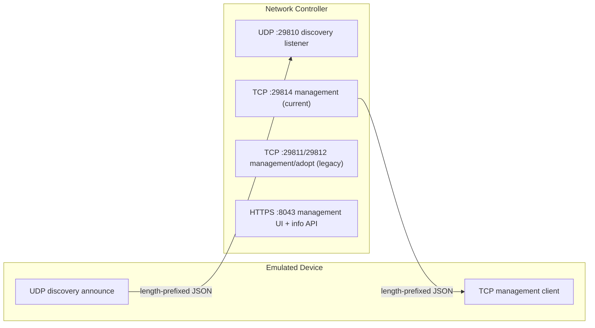

# Device Discovery & Adoption Protocol — Implementation Reference

This document describes the wire protocol that a managed network device (an
access point, switch, or gateway) uses to be **discovered** and **adopted**
by a network controller, as needed to re-implement an emulated device from
scratch.

Everything below was validated by sending packets to a live controller and
observing its behavior. Each claim is tagged with its confidence level:

- **CONFIRMED** — a packet built exactly as described was accepted by a real
  controller and produced the stated result.
- **PROVISIONAL** — the shape is understood but not yet fully validated
  end-to-end; treat as a starting point and re-verify.
- **OPEN** — not yet worked out; documented so the gap is explicit.

---

## 1. Big picture



A device announces itself over **UDP** on port 29810. The controller records
it and — depending on what the device reports — either files it as
"managed by another controller" or offers it for **adoption**. Once an
operator starts adoption, the controller drives the rest of the exchange over
the **TCP management channel** (port 29814).

### 1.1 Ports

| Purpose | Proto | Port | Notes |
|---|---|---:|---|
| Discovery | UDP | 29810 | Device → controller announce (and controller → device pre-adopt reply) |
| Management, legacy | TCP | 29811 | Older device firmware generation |
| Adopt, legacy | TCP | 29812 | Older device firmware generation |
| Upgrade, legacy | TCP | 29813 | Older device firmware generation |
| Management, current | TCP | 29814 | Primary channel for current firmware generation |
| Info / capture transfer | TCP | 29815 | |
| Remote terminal | TCP | 29816 | |
| Device monitoring | TCP | 29817 | |
| Management UI + info API (HTTPS) | TCP | 8043 | |
| Management UI (HTTP) | TCP | 8088 | |

**CONFIRMED:** the controller binds UDP 29810 and genuinely parses a
hand-crafted packet sent to it (its own logs show the packet being decoded
and matched to a device record).

---

## 2. Message envelope (all channels)

Every message — discovery, pre-adopt, adopt, inform — is a JSON document with
two top-level objects:

```json
{ "header": { ... }, "body": { ... } }
```

### 2.1 Wire framing — CONFIRMED (UDP), PROVISIONAL (TCP)

```
bytes 0-3 : total JSON length, big-endian uint32
bytes 4.. : UTF-8 JSON document (the envelope above)
```

No application-layer encryption was observed on the discovery channel — it is
**plaintext JSON**. The TCP management channel uses the same 4-byte-length +
JSON framing; a plain (unencrypted) connection to port 29814 is recognized by
the controller and advances a pending device's internal state (see §7), so no
application-layer cipher is required to begin the TCP exchange. The
sensitive management UI/API rides on HTTPS (8043), which already provides
transport security.

---

## 3. `header` fields

| Field | Type | Notes |
|---|---|---|
| `mac` | string | Device MAC, formatted `AA-BB-CC-DD-EE-FF` (hyphens, uppercase). Identity key. |
| `type` | int | Message type code, see §3.2 |
| `device` | string | Device type string, see §3.1 |
| `version` | string | **Required.** Protocol version, e.g. `"2.0.0"` (current) or `"1.0.0"` (legacy). Omitting it makes the controller reject the packet. |
| `verCap` | int | Version-capability bitmask; observed value `3` (device supports both protocol generations). |
| `timestamp` | long | Epoch **milliseconds**. Packets older than the discovery cooldown (default 20000 ms) are dropped as stale — keep this close to current time. |
| `seq` | int | Sequence number (optional on discovery). |
| `error` | int | Response error code; `0` on requests. |
| `compress` | string | If present (e.g. `"lzo-2.07"`), the body is compressed. Omit for plain JSON. |
| `dest` | string | Destination controller ID (used in multi-controller setups). |
| `ip` | string | Filled in server-side from the packet source; not required in requests. |

### 3.1 `device` type strings — CONFIRMED

| Wire string | Meaning |
|---|---|
| `ap` | Access point |
| `switch` | Switch |
| `gateway` | Gateway / router |

(The controller also recognizes additional product-line variants and optical
device types, not covered here.)

### 3.2 `type` — message type codes

Only `DISCOVERY` (1) is CONFIRMED end-to-end. The rest are documented for
completeness (PROVISIONAL) and reflect the controller's known message set:

| Name | Value | Purpose |
|---|---:|---|
| `DISCOVERY` | 1 | UDP announce (this document's main focus) |
| `PRE_ADOPT_REQUEST` | 2 | Controller tells the device which port to connect to for adoption |
| `PRE_CONNECT_INFO` | 3 | Pre-connection info exchange |
| `ADOPT_REQUEST` | 16 | Adoption handshake request |
| `ADOPT_RESPONSE` | 32 | Adoption handshake response |
| `INFORM_REQUEST` / `INFORM_RESPONSE` | 256 / 512 | Steady-state periodic check-in |
| `SET_REQUEST` / `SET_RESPONSE` | 4096 / 8192 | Push configuration to the device |
| `INIT_SYNC` | 4352 | Initial full-config sync |
| `GET_REQUEST` / `GET_RESPONSE` | 24576 / 28672 | On-demand config/state query |
| `FORGET_REQUEST` / `FORGET_RESPONSE` | 16384 / 20480 | "Forget" (reset) the device |
| `UPGRADE_REQUEST` / `UPGRADE_RESPONSE` | 32768 / 65536 | Firmware upgrade |
| `REBUILD_REQUEST` / `REBUILD_RESPONSE` | 36864 / 40960 | Config rebuild |
| `DEVICE_VERIFY_INFO` / `..._RESPONSE` | 0x100001 / 0x100002 | Device identity verification (part of the TCP adopt handshake) |
| `DEVICE_NEGOTIATION` / `SYSTEM_NEGOTIATION` | 0x100004 / 0x100005 | Capability negotiation |
| `REPORT` | 0x150000 | Telemetry upload |

---

## 4. Discovery (`type = 1`) — body shape, per device type

**This section is CONFIRMED by live round-trip testing.** A packet built
exactly as shown below was accepted by a real controller with no errors, and
the device then appeared in the controller's device list.

A key detail: **the JSON field names differ between device types.** Access
points use longer, camelCase keys and a `controllerSetting` object; switches
and gateways use short keys and a `controller` object. Getting these wrong
causes the controller to reject the packet.

### 4.1 Access point (`device: "ap"`) — CONFIRMED

```json
{
  "deviceInfo": {
    "ip": "192.168.56.53",
    "model": "EAP245",
    "modelVersion": "3.0",
    "firmwareVersion": "5.1.0 Build 20230101 Rel.12345",
    "hardwareVersion": "3.0",
    "name": "lab-ap-01",
    "upTime": "60",
    "cpuUti": 5,
    "memUti": 30,
    "wirelessLinked": false,
    "p2p": false
  },
  "deviceMisc": {
    "customizeRegion": 0
  },
  "controllerSetting": {
    "controllerId": "<controller ID — see §6>"
  }
}
```

Required-field notes:
- `deviceMisc.customizeRegion` (integer country/region code) is **required** —
  the controller reads it without a null-check and drops the packet if it is
  missing.
- `controllerSetting.controllerId` is **required** (see §6 for what value to
  send).
- `deviceInfo.p2p` should be a real boolean (sent, not omitted).
- `cpuUti`/`memUti` are the CPU/memory utilization percentages.
- Many additional capability flags exist in `deviceMisc` (radio support, LAG,
  mesh, PoE port lists, channel limits, etc.) but none were needed for a
  successful discovery.

### 4.2 Switch (`device: "switch"`) — CONFIRMED

Note the shorter keys and the `controller` object (with nested key `id`, not
`controllerId`):

```json
{
  "deviceInfo": {
    "ip": "192.168.56.60",
    "model": "TL-SG3210",
    "modelVer": "1.0",
    "fwVer": "1.0.0 Build 20230101 Rel.12345",
    "hwVer": "1.0",
    "time": "60"
  },
  "deviceMisc": {
    "portNum": 10
  },
  "controller": {
    "id": "<controller ID — see §6>"
  },
  "stackId": ""
}
```

Field-name mapping vs. the access-point body: `modelVer`←→`modelVersion`,
`fwVer`←→`firmwareVersion`, `hwVer`←→`hardwareVersion`, `time`←→`upTime`.
`deviceMisc` for a switch is minimal — just `portNum`. Optional stacking
fields (`stackMember`, `stackableNum`, `stkMac`, `chipCap`) exist but are not
required.

### 4.3 Gateway (`device: "gateway"`) — CONFIRMED

Same short-key / `controller` object convention as the switch, plus a couple
of gateway-specific fields:

```json
{
  "deviceInfo": {
    "ip": "192.168.56.70",
    "model": "ER605",
    "modelVer": "1.0",
    "fwVer": "1.0.0 Build 20230101 Rel.12345",
    "cerVer": "1.0",
    "hwVer": "1.0",
    "time": "60",
    "wireless": 0
  },
  "deviceMisc": {
    "portNum": 5,
    "customizeRegion": 0
  },
  "controller": {
    "id": "<controller ID — see §6>"
  }
}
```

`cerVer` is a certification/version string; `wireless` indicates a built-in
radio. `deviceMisc` may also carry the same wireless capability flags as an
access point (some gateways include integrated Wi-Fi), but only the minimal
set above is needed for discovery.

---

## 5. Adoptability: "Managed by another controller" vs. "Pending" — CONFIRMED

Whether a freshly discovered device is offered for **adoption** depends on the
value it puts in the discovery body's controller-ID field:

- If it reports the **real controller ID** (from §6), the controller treats
  it as belonging to some other controller and files it under **"Managed by
  another controller"** — it appears in the list but cannot be selected for
  adoption.
- If it reports the **factory / unconfigured sentinel value**
  `c21f969b5f03d33d43e04f8f136e7682`, the controller treats the device as
  factory-default and marks it **PENDING** (adoptable) — it becomes
  selectable, and an operator can assign it to a site and adopt it.

So an emulator that wants to be adoptable sends
`controllerSetting.controllerId` (AP) / `controller.id` (switch, gateway) =
`c21f969b5f03d33d43e04f8f136e7682` in its discovery announce.

Observed controller-side status labels through the adoption attempt:
`PENDING` → `ADOPTING` → (`ADOPT FAILED` if the device never completes the TCP
handshake). The goal end state is an online, managed device.

---

## 6. Obtaining the controller ID — CONFIRMED

The controller exposes its own unique identifier via an **unauthenticated**
HTTPS request:

```
GET https://<controller-host>:8043/api/info
```

The JSON response contains the controller's ID inside its `result` object
(alongside the controller version and setup state). That value is what goes
into the discovery body's controller-ID field in §4 — either the real value
(to appear as managed elsewhere) or the sentinel from §5 (to appear as
adoptable).

---

## 7. Adoption over TCP (port 29814) — PARTIALLY CONFIRMED / OPEN

Once an operator triggers adoption, the following has been observed:

1. **CONFIRMED:** while the device keeps sending its periodic discovery
   announce, the controller starts **replying over UDP** with a
   `PRE_ADOPT_REQUEST` (`type: 2`) whose body tells the device where to
   connect:
   ```json
   {
     "header": { "version": "2.0.0", "mac": "...", "type": 2, "error": 0,
                 "dest": "<controller ID>" },
     "body": { "adoptPort": 29814 }
   }
   ```
2. **CONFIRMED:** opening a plain TCP connection to the indicated port
   (29814) and sending a length-prefixed JSON message is recognized by the
   controller — it matches the connection to the pending device and advances
   its internal state (from "pending" to an "adopting / pre-adopt" phase).
   This confirms the TCP channel uses the same framing and envelope as the
   UDP channel and needs no application-layer encryption to begin.
3. **OPEN:** the exact message sequence that carries the device through
   adoption to a fully online state is not yet worked out. The controller's
   message set includes a device-verification step
   (`DEVICE_VERIFY_INFO`/`DEVICE_VERIFY_RESPONSE`, which carry a random
   verification key), capability negotiation
   (`DEVICE_NEGOTIATION`/`SYSTEM_NEGOTIATION`), an initial config sync
   (`INIT_SYNC`), and then the steady-state inform loop
   (`INFORM_REQUEST`/`INFORM_RESPONSE`). Completing this is future work.

**Summary of the confirmed lifecycle so far:**
discovery announce → **PENDING** (with sentinel controller ID) → operator
adopts → **ADOPTING** → controller pushes `adoptPort` over UDP → device
connects TCP 29814 → controller advances to the pre-adopt phase → *(remaining
verify / negotiate / sync / inform steps: OPEN)*.

---

## 8. Reference constants (CONFIRMED)

```
DISCOVERY_UDP_PORT       = 29810
MANAGER_V1_TCP_PORT      = 29811   # legacy
ADOPT_V1_TCP_PORT        = 29812   # legacy
UPGRADE_V1_TCP_PORT      = 29813   # legacy
MANAGER_V2_TCP_PORT      = 29814   # current
TRANSFER_V2_TCP_PORT     = 29815
RTTY_TCP_PORT            = 29816
DEVICE_MONITOR_TCP_PORT  = 29817
MGMT_HTTPS_PORT          = 8043
MGMT_HTTP_PORT           = 8088

MESSAGE_TYPE_DISCOVERY   = 1
MESSAGE_TYPE_PRE_ADOPT   = 2

DEVICE_TYPE_AP           = "ap"
DEVICE_TYPE_SWITCH       = "switch"
DEVICE_TYPE_GATEWAY      = "gateway"

DISCOVERY_COOLDOWN_MS    = 20000   # announces older than this (by header.timestamp) are dropped
FACTORY_CONTROLLER_ID    = "c21f969b5f03d33d43e04f8f136e7682"   # sentinel that marks a device adoptable
```

---

## 9. Implementation checklist

- [x] 4-byte big-endian length prefix + UTF-8 JSON `{header, body}` envelope.
- [x] `header.version` set (`"2.0.0"`), `header.timestamp` current (ms).
- [x] Per-device-type discovery body (mind the AP vs. switch/gateway key
      differences and the `controllerSetting`/`controllerId` vs.
      `controller`/`id` split).
- [x] `deviceMisc.customizeRegion` present for AP/gateway.
- [x] Controller ID fetched from `GET /api/info`; use the factory sentinel to
      appear adoptable.
- [x] Periodic UDP announce on port 29810.
- [ ] TCP management client (port 29814): device-verify → negotiate →
      init-sync → inform loop (OPEN).
