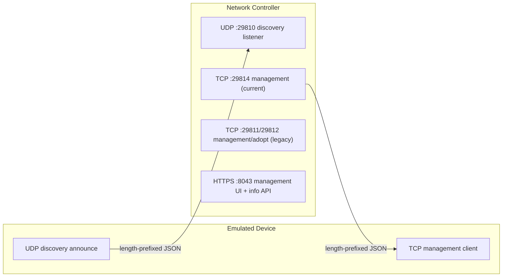

# Device Discovery & Adoption Protocol — Implementation Reference

This document describes the wire protocol that a managed network device (an
access point, switch, gateway, or OLT) uses to be **discovered** and
**adopted** by a network controller, as needed to implement an emulated
device from scratch.

Everything below was validated by sending packets to a live controller and
observing its behavior. Discovery and the full adoption handshake are
validated end-to-end against both **controller v5.15** (ECSP 1.3.7) and
**controller v6.2** (ECSP 1.7.3). Each claim is tagged with its confidence
level:

- **CONFIRMED** — a packet built exactly as described was accepted by a real
  controller and produced the stated result.
- **PROVISIONAL** — the shape is understood but not yet fully validated
  end-to-end; treat as a starting point and re-verify.
- **OPEN** — not yet worked out; documented so the gap is explicit.

---

## 1. Big picture


```mermaid
flowchart LR
    subgraph Device["Emulated Device"]
        D1["UDP discovery announce"]
        D2["TCP management client"]
    end
    subgraph Controller["Network Controller"]
        C1["UDP :29810 discovery listener"]
        C2["TCP :29814 management (current)"]
        C3["TCP :29811/29812 management/adopt (legacy)"]
        C4["HTTPS :8043 management UI + info API"]
    end
    D1 -->|"length-prefixed JSON"| C1
    C2 -->|"length-prefixed JSON"| D2
```

A device announces itself over **UDP** on port 29810. The controller records
it and — depending on what the device reports — either files it as
"managed by another controller" or offers it for **adoption**. Once an
operator starts adoption, the controller drives the rest of the exchange over
the **TLS management channel** (port 29814).

### 1.1 Ports

| Purpose | Proto | Port | Notes |
|---|---|---:|---|
| Discovery | UDP | 29810 | Device → controller announce (and controller → device pre-adopt reply) |
| Management, legacy | TCP | 29811 | Older device firmware generation |
| Adopt, legacy | TCP | 29812 | Older device firmware generation |
| Upgrade, legacy | TCP | 29813 | Older device firmware generation |
| Management, current | TCP | 29814 | Primary channel for current firmware generation |
| Info / capture transfer | TCP | 29815 | |
| Remote terminal | TCP | 29816 | RTTY server (terminal + Remote Access reverse tunnels, §10) |
| Device monitoring | TCP | 29817 | |
| Management UI + info API (HTTPS) | TCP | 8043 | |
| Management UI (HTTP) | TCP | 8088 | |

**CONFIRMED:** the controller binds UDP 29810 and genuinely parses a
hand-crafted packet sent to it (its own logs show the packet being decoded
and matched to a device record).

---

## 2. Message envelope (all channels)

Every message — discovery, pre-adopt, adopt, inform — is a JSON document with
two top-level objects:

```json
{ "header": { ... }, "body": { ... } }
```

### 2.1 Wire framing — CONFIRMED (UDP and TLS management channel)

```
bytes 0-3 : total JSON length, big-endian uint32
bytes 4.. : UTF-8 JSON document (the envelope above)
```

No application-layer encryption is used on the discovery channel — it is
**plaintext JSON** over UDP. The current management channel (port 29814) uses
the **same** 4-byte-length + JSON framing, but inside a **TLS** stream: the
port presents a vendor certificate (CN=localhost) and a plain-TCP connection
is silently dropped, so the device must wrap the socket in TLS (see §7.2). No
client certificate is required.

---

## 3. `header` fields

| Field | Type | Notes |
|---|---|---|
| `mac` | string | Device MAC, formatted `AA-BB-CC-DD-EE-FF` (hyphens, uppercase). Identity key. |
| `type` | int | Message type code, see §3.2 |
| `device` | string | Device type string, see §3.1 |
| `version` | string | **Required.** Protocol version, e.g. `"2.0.0"` (current) or `"1.0.0"` (legacy). Omitting it makes the controller reject the packet. |
| `verCap` | int | Version-capability bitmask; observed value `3` (device supports both protocol generations). |
| `timestamp` | long | Epoch **milliseconds**. Packets older than the discovery cooldown (default 20000 ms) are dropped as stale — keep this close to current time. |
| `seq` | int | Sequence number (optional on discovery). |
| `error` | int | Response error code; `0` on requests. |
| `compress` | string | If present (e.g. `"lzo-2.07"`), the body is compressed. Omit for plain JSON. |
| `dest` | string | Destination controller ID (used in multi-controller setups). |
| `ip` | string | Filled in server-side from the packet source; not required in requests. |

### 3.1 `device` type strings — CONFIRMED

| Wire string | Meaning |
|---|---|
| `ap` | Access point |
| `switch` | Switch |
| `gateway` | Gateway / router |
| `olt` | PON optical line terminal (CONFIRMED — see §4.4) |

(The controller also recognizes additional product-line variants and optical
device types; `olt` is the wire string for the OLT device type, alongside
`ap`/`switch`/`gateway` and the peer `onu` type.)

### 3.2 `type` — message type codes

`DISCOVERY` (1) and the full management-channel handshake (§7) are CONFIRMED
end-to-end. The remaining codes are documented for completeness and reflect
the controller's known message set:

| Name | Value | Purpose |
|---|---:|---|
| `DISCOVERY` | 1 | UDP announce (this document's main focus) |
| `PRE_ADOPT_REQUEST` | 2 | Controller tells the device which port to connect to for adoption |
| `PRE_CONNECT_INFO` | 3 | Pre-connection info exchange |
| `ADOPT_REQUEST` | 16 | Adoption handshake request |
| `ADOPT_RESPONSE` | 32 | Adoption handshake response |
| `INFORM_REQUEST` / `INFORM_RESPONSE` | 256 / 512 | Steady-state periodic check-in |
| `SET_REQUEST` / `SET_RESPONSE` | 4096 / 8192 | Push configuration to the device |
| `INIT_SYNC` | 4352 | Initial full-config sync |
| `GET_REQUEST` / `GET_RESPONSE` | 24576 / 28672 | On-demand config/state query |
| `FORGET_REQUEST` / `FORGET_RESPONSE` | 16384 / 20480 | "Forget" (reset) the device |
| `UPGRADE_REQUEST` / `UPGRADE_RESPONSE` | 32768 / 65536 | Firmware upgrade |
| `REBUILD_REQUEST` / `REBUILD_RESPONSE` | 36864 / 40960 | Config rebuild |
| `DEVICE_VERIFY_INFO` / `..._RESPONSE` | 0x100001 / 0x100002 | Device identity verification (part of the TLS adopt handshake, §7) |
| `DEVICE_NEGOTIATION` / `SYSTEM_NEGOTIATION` | 0x100004 / 0x100005 | Capability negotiation |
| `REPORT` | 0x150000 | Telemetry upload |

---

## 4. Discovery (`type = 1`) — body shape, per device type

**This section is CONFIRMED by live round-trip testing.** A packet built
exactly as shown below was accepted by a real controller with no errors, and
the device then appeared in the controller's device list.

A key detail: **the JSON field names differ between device types.** Access
points use longer, camelCase keys and a `controllerSetting` object; switches
and gateways use short keys and a `controller` object. Getting these wrong
causes the controller to reject the packet.

### 4.1 Access point (`device: "ap"`) — CONFIRMED

```json
{
  "deviceInfo": {
    "ip": "192.168.56.53",
    "model": "EAP245",
    "modelVersion": "3.0",
    "firmwareVersion": "5.1.0 Build 20230101 Rel.12345",
    "hardwareVersion": "3.0",
    "name": "lab-ap-01",
    "upTime": "60",
    "cpuUti": 5,
    "memUti": 30,
    "wirelessLinked": false,
    "p2p": false
  },
  "deviceMisc": {
    "customizeRegion": 0
  },
  "controllerSetting": {
    "controllerId": "<controller ID — see §6>"
  }
}
```

Required-field notes:
- `deviceMisc.customizeRegion` (integer country/region code) is **required** —
  the controller reads it without a null-check and drops the packet if it is
  missing.
- `controllerSetting.controllerId` is **required** (see §6 for what value to
  send).
- `deviceInfo.p2p` should be a real boolean (sent, not omitted).
- `cpuUti`/`memUti` are the CPU/memory utilization percentages.
- Many additional capability flags exist in `deviceMisc` (radio support, LAG,
  mesh, PoE port lists, channel limits, etc.) but none were needed for a
  successful discovery.

### 4.2 Switch (`device: "switch"`) — CONFIRMED

Note the shorter keys and the `controller` object (with nested key `id`, not
`controllerId`):

```json
{
  "deviceInfo": {
    "ip": "192.168.56.60",
    "model": "TL-SG3210",
    "modelVer": "1.0",
    "fwVer": "1.0.0 Build 20230101 Rel.12345",
    "hwVer": "1.0",
    "time": "60"
  },
  "deviceMisc": {
    "portNum": 10
  },
  "controller": {
    "id": "<controller ID — see §6>"
  },
  "stackId": ""
}
```

Field-name mapping vs. the access-point body: `modelVer`←→`modelVersion`,
`fwVer`←→`firmwareVersion`, `hwVer`←→`hardwareVersion`, `time`←→`upTime`.
`deviceMisc` for a switch is minimal — just `portNum`. Optional stacking
fields (`stackMember`, `stackableNum`, `stkMac`, `chipCap`) exist but are not
required.

### 4.3 Gateway (`device: "gateway"`) — CONFIRMED

Same short-key / `controller` object convention as the switch, plus a couple
of gateway-specific fields:

```json
{
  "deviceInfo": {
    "ip": "192.168.56.70",
    "model": "ER605",
    "modelVer": "1.0",
    "fwVer": "1.0.0 Build 20230101 Rel.12345",
    "cerVer": "1.0",
    "hwVer": "1.0",
    "time": "60",
    "wireless": 0
  },
  "deviceMisc": {
    "portNum": 5,
    "customizeRegion": 0
  },
  "controller": {
    "id": "<controller ID — see §6>"
  }
}
```

`cerVer` is a certification/version string; `wireless` indicates a built-in
radio. `deviceMisc` may also carry the same wireless capability flags as an
access point (some gateways include integrated Wi-Fi), but only the minimal
set above is needed for discovery.

### 4.4 OLT / PON optical line terminal (`device: "olt"`) — CONFIRMED

**Live-validated against controller v6.2.14.11** (ECSP 1.8.6). A discovery
packet built exactly as below was accepted by a real controller, the device
appeared as adoptable (`compatible: 0`), and the full adoption handshake
reached **CONNECTED** (see §7.9).

A PON optical line terminal is the headend of a GPON/EPON passive optical
network: a wired aggregation device that terminates PON links and manages a
tree of ONUs off its PON ports. The controller has a dedicated OLT
management subsystem covering PON/ONU, QoS, L3, IGMP/multicast, security
and firmware management for this device type.

The discovery body uses the **AP-style long-name `deviceInfo` keys** but the
**switch/gateway `controller`/`id` convention**. `deviceMisc` is the shared
base device-misc shape; PON/LAG counts are reported later during negotiation:

```json
{
  "deviceInfo": {
    "ip": "192.168.56.80",
    "model": "DS-P7001-08",
    "modelVersion": "1.0",
    "firmwareVersion": "1.0.0 Build 20230101 Rel.12345",
    "hardwareVersion": "1.0",
    "name": "lab-olt-01",
    "upTime": 60
  },
  "deviceMisc": {
    "modelType": "NORMAL",
    "category": "OLT"
  },
  "controller": {
    "id": "<controller ID — see §6>"
  }
}
```

Field-name mapping vs. the switch/gateway body: the OLT uses the long-name
keys (`modelVersion`/`firmwareVersion`/`hardwareVersion`/`upTime`) like the
access point, not the short keys (`modelVer`/`fwVer`/`hwVer`/`time`). The
`deviceInfo.upTime` is a JSON integer. The OLT device-misc shape is a
subclass of the base device-misc shape (`modelType`/`category`/
`supportCluster`) — the emulator sends `modelType` and `category`;
`supportCluster` is optional and omitted. It does not carry
`ponPortCount`/`lagCount`/`customizeRegion`. The OLT discovery V2 body names
its controller field as `"controller"`, and the controller-setting
sub-object names `controllerId` as `"id"`.

Source formats:
- OLT discovery device info (a subclass of the base discovery device info) —
  `ip`, `name`, `model`, `modelVersion`, `firmwareVersion`, `hardwareVersion`,
  `upTime`, `isFactoryDefault`, `dest`.
- OLT negotiation device info — `model`, `modelVersion`, `firmwareVersion`,
  `hardwareVersion`, `hwId`, `oemId`, `lagCount`, `ponPortCount`.
- OLT discovery V2 body / controller setting — the `controller.id` envelope.

> **Caveat.** The numeric `typeInt` code for `OLT` in the device-type enum,
> and any OLT-specific `header.type` message codes, are not documented here.
> The emulator reuses the generic V2 management-channel message codes (§7);
> confirming the exact OLT wire behaviour requires guided live-packet
> fuzzing as was done for AP/Switch/Gateway in §4.

---

## 5. Adoptability: "Managed by another controller" vs. "Pending" — CONFIRMED

Whether a freshly discovered device is offered for **adoption** depends on the
value it puts in the discovery body's controller-ID field:

- If it reports the **real controller ID** (from §6), the controller treats
  it as belonging to some other controller and files it under **"Managed by
  another controller"** — it appears in the list but cannot be selected for
  adoption.
- If it reports the **factory / unconfigured sentinel value**
  `c21f969b5f03d33d43e04f8f136e7682`, the controller treats the device as
  factory-default and marks it **PENDING** (adoptable) — it becomes
  selectable, and an operator can assign it to a site and adopt it.

So an emulator that wants to be adoptable sends
`controllerSetting.controllerId` (AP) / `controller.id` (switch, gateway) =
`c21f969b5f03d33d43e04f8f136e7682` in its discovery announce.

Observed controller-side status labels through the adoption attempt:
`PENDING` → `ADOPTING` → (`ADOPT FAILED` if the device never completes the TCP
handshake). The goal end state is an online, managed device.

---

## 6. Obtaining the controller ID — CONFIRMED

The controller exposes its own unique identifier via an **unauthenticated**
HTTPS request:

```
GET https://<controller-host>:8043/api/info
```

The JSON response contains the controller's ID inside its `result` object
(alongside the controller version and setup state). That value is what goes
into the discovery body's controller-ID field in §4 — either the real value
(to appear as managed elsewhere) or the sentinel from §5 (to appear as
adoptable).

---

## 7. Adoption over the TLS management channel (port 29814) — CONFIRMED

Once an operator triggers adoption, the device is driven all the way to
**Connected** over the management channel. The full sequence below was
validated live end-to-end (the emulated device reaches the controller's
"Connected" status and stays online).

### 7.1 Pre-adopt trigger (UDP)

While the device keeps sending its periodic discovery announce, the controller
answers the device's *next* announce over **UDP** (to the announce's source
address/port) with a `PRE_ADOPT_REQUEST` (`type: 2`) whose body names the port
to connect to:
```json
{
  "header": { "version": "2.0.0", "mac": "...", "type": 2, "error": 0,
              "dest": "<controller ID>" },
  "body": { "adoptPort": 29814 }
}
```
The device must keep the same UDP socket open (source port stable) to receive
this reply. Once received, the device should **stop announcing** — more than a
few discovery announces while the controller is adopting cause the adoption to
be aborted.

### 7.2 TLS transport

The management port (29814) is presented **behind TLS**. The server offers a
vendor certificate (CN=localhost) and does **not** request a client
certificate. A plain-TCP connection is accepted at the socket layer but then
silently dropped, so the device must wrap the connection in TLS (no
verification needed for a lab controller; use `server_hostname="localhost"`).
The same 4-byte length prefix + UTF-8 JSON `{header, body}` framing is used
inside the TLS stream. The management-channel `header` is
`{version, mac, type, device, error, timestamp, seq}` (no `verCap`). The
`timestamp` (epoch milliseconds) is always sent — the controller's notify
dispatcher dereferences it unguarded (see §11.8).

### 7.3 Handshake sequence — CONFIRMED

Device-initiated messages carry an incrementing `seq`; replies to
controller-initiated messages echo the received `seq`.

| # | Direction | `type` | Purpose |
|---|-----------|--------|---------|
| 1 | device → | `PRE_CONNECT_INFO` (3) | `{needUsername:true, rebuild:0}` |
| 2 | ← device | `PRE_CONNECT_INFO_RESPONSE` (0x100000) | `{randomKeyForDeviceVerify, username}` (newer controllers also include `cipherCap`, e.g. `[4,5]`) |
| 3 | device → | `DEVICE_VERIFY_INFO` (0x100001) | `{auth, randomKeyForSystemVerify}` — `randomKeyForSystemVerify` **must be a 36-char hyphenated UUID** (see §7.4) |
| 4 | ← device | `DEVICE_VERIFY_RESPONSE` (0x100002) | `error==0` ⇒ controller authenticated the device (its body `auth` mutually authenticates the controller) |
| 5 | device → | `SYSTEM_VERIFY_RESULT` (0x100003) | `{}` |
| 6 | ← device | `VERIFY_RESULT_ACK` (0x100009) | mutual verification complete |
| 7 | device → | `DEVICE_NEGOTIATION` (0x100004) | capabilities + `controllerSetting.controllerId` (the **real** controller ID) + a non-empty `components_v2` manifest (see §7.5) |
| 8 | ← device | `SYSTEM_NEGOTIATION` (0x100005) | controller's negotiation reply |
| 9 | device → | `INIT_SYNC_RESULT` (0x100006) | `{}` (echo seq) |
| 10 | ← device | `INIT_SYNC_RESULT_ACK` (0x10000A) | device transitions to **Connected** |
| 11 | device → | `INFORM_REQUEST` (256) every ~10 s | `{deviceInfo, configVersion}` heartbeat — keeps the device online |

During the connected phase the controller may also send `SET_REQUEST` (4096),
`GET_REQUEST` (24576), and `NOTIFY_REQUEST` (80 / 0x100007); the device
acknowledges each with the matching response
(`SET_RESPONSE` 8192 / `GET_RESPONSE` 28672 / `NOTIFY_REPLY` 144 / 0x100008),
echoing the request `seq`.

**`SET_REQUEST` acknowledgement — CONFIRMED (controller v6.2).** After the
first `INFORM_REQUEST`, the controller pushes the full device configuration as
a `SET_REQUEST` body (a large object keyed by feature: `wanIpv4`, `wanMac`,
`network`, `serviceType`, `ipGroup`, `ipv6Group`, `onlineDetection`,
`attackDefense`, `natAlg`, `sessionLimit`, `bandwidthCtrl`, `wanIpv6`, `upnp`,
`mdns`, `ssh`, `iptv`, `firewallConfig`, `led`, `snmp`, `echoServer`, `lldp`,
`hwOffload`, `privacyPolicy`, `wanBasicSetting`, and more; the body also
carries a numeric `sequenceId` and the target `configVersion`).

The device **must not** reply with an empty body: the controller requires the
`SET_RESPONSE` to acknowledge the config sync. The response body is:
```json
{
  "sequenceId": <echoed from the request>,
  "errcode": 0,
  "configVersion": <echoed from the request>
}
```
Echoing `configVersion` is what makes the controller record the config as
**applied**. An empty `{}` body makes the controller treat the sync as
**failed** and **forget** the device (the management channel is closed within
milliseconds and the adoption is rolled back to `ADOPT FAILED`). Per-feature
ack sub-objects (the WAN port response, the network response, …) exist in
the response format but are optional — the base ack above is sufficient to
keep the device `CONNECTED`.

`GET_REQUEST` and `NOTIFY_REQUEST` replies may be empty acks (a `GET_RESPONSE`
may carry `{sequenceId, errcode:0}` plus optional per-feature bodies the
controller's detail-page tabs query live; a `NOTIFY_REPLY` may be `{}`).

### 7.4 Device authentication — CONFIRMED

The `auth` token in step 3 proves the device knows the management credential:
```
auth = SHA256( SHA256(username + MD5(password)) + randomKeyForDeviceVerify )
```
Every intermediate hash is rendered as an **UPPERCASE** hex string before being
fed into the next hash (the controller's implementation uppercases its hex, and
because the digests are hash *inputs*, casing changes the result). The default
device credential is `admin` / `admin`; the username/password must match what
the operator supplies when adopting.

**Force Provision reconnect — CONFIRMED (controller v6.2.14.11).** Force
Provision deliberately closes the management channel and expects the device
to reconnect using a V2 pre-connect body with `rebuild:1`, its discovery
`deviceInfo` / `deviceMisc`, and the real `controllerSetting.controllerId`.
The rebuild verification credential is the site's **Device Account**, which
may differ from the credentials entered for initial adoption. The controller
provisions it as `userAccount` (the new username / new password fields of the
user-account config) in the initial sync body; the emulator captures it from `SYSTEM_NEGOTIATION` /
`INIT_SYNC` and from later `userAccount` SET pushes. Optional
`adopt.managed_username` / `adopt.managed_password` settings remain as
fallback overrides for controller variants that omit the payload. With the
provisioned Device Account, the AP reconnected automatically in about one
second, returned to `CONNECTED`, and accepted another full configuration
containing `ssid_2G` / `ssid_5G`. No UI Retry was required.

**`randomKeyForSystemVerify` length — CONFIRMED.** The device's own verify
nonce must be a full **36-character hyphenated UUID**. Newer controllers
(ECSP 1.7.x, e.g. controller v6.2) reject anything shorter than 36 characters
(`INVALID_DEVICE_RANDOMKEY`) *before* checking the auth, so a 32-char hex
string silently fails as "username or password incorrect". A 36-char UUID is
accepted by older controllers too.

**Controller-version compatibility — CONFIRMED.** The handshake above is
validated end-to-end against both **controller v5.15** (ECSP 1.3.7) and
**controller v6.2** (ECSP 1.7.3). The message sequence, the auth formula, and
the uppercase-hex convention are identical across both; the only observable
delta is the 36-char nonce enforcement above (and a new advertised
`cipherCap` list — the default MD5 cipher path remains accepted, so no cipher
negotiation is required). `DEVICE_VERIFY_RESPONSE` is compared
case-insensitively on v6.2.

### 7.5 Being reported as "compatible" — CONFIRMED

After adoption the controller marks a device **compatible** or shows a
warning ("The device is not compatible with the current controller"). Two
independent inputs drive this:

- **Advertised protocol version.** The controller parses the device's ECSP
  version into `[major, minor]` and compares it against the per-device-type
  "fit" version it supports. For an access point, both v5.15 and v6.2 expect
  EAP fit version **2.3**, so the device advertises `header.version = 2.3.0`
  (major 2 / minor 3). **Switches and gateways** are classified at fit version
  **2.2**, so they advertise `header.version = 2.2.0`. A wrong minor is logged
  as `LOW_MINOR_VER` / `HIGH_MINOR_VER` and contributes to the incompatible
  state.
- **Component manifest.** The negotiation `components_v2` map
  (`{componentName: version}`) must be **non-empty**: the controller builds a
  component descriptor from it and treats an empty result as invalid
  (compatibility value 7 = not manage-compatible). Reporting a realistic
  per-type manifest (access-point components such as `wlanBasic`/`ssid`, or
  the switch/gateway component sets) yields compatibility value 0 (fully
  compatible) and clears the warning. CONFIRMED on both v5.15 and v6.2.

Each device type also sends its own negotiation shape: switches and gateways
use short-name `deviceInfo` fields (`modelVer`/`fwVer`/`hwVer`/`time`/`cu`/`mu`
plus type-specific identity fields) and carry a type-specific capability
descriptor (`devCap` with port/spec info); the OLT reuses the AP-style
long-name `deviceInfo` plus OLT identity fields (`hwId`/`oemId`/`lagCount`/
`ponPortCount`/`wirelessLinked`) and a minimal `devCap` (see §7.9). Access
points, switches, gateways, and the OLT are all confirmed to reach
**Connected** and **compatible** end-to-end (OLT confirmed on controller
v6.2.14.11).

**Summary of the confirmed lifecycle:**
discovery announce (sentinel controller ID) → **PENDING** → operator adopts →
**ADOPTING** → controller pushes `adoptPort` over UDP → device opens TLS to
29814 → pre-connect → verify (mutual) → negotiate → init-sync →
**CONNECTED** → periodic `INFORM_REQUEST` keeps it online.

### 7.6 Topology map — CONFIRMED

The controller draws the topology map (gateway → switch → access point) by
correlating adjacency data the devices report in their periodic
`INFORM_REQUEST`, keyed by component. A scheduled task rebuilds the successor
tree, so links appear a short delay after the informs. Each device type
reports different sections:

- **Switch** — `port` (per-port link status; the connecting ports reported up),
  `lldp` (per-port LLDP neighbour table: `{lldps:[{port, standardPort,
  neighbors:[{chassisId=<neighbour MAC>, portId, …}]}]}`), and `fdb` (MAC
  forwarding table: `{fdbs:[{port, standardPort, macs:[{mac}]}]}`). A wired AP
  is placed under the switch from the switch's LLDP/FDB entry for the AP's MAC.
  (The topology map also accepts the older `{portId, standardOswPort}` wrapper,
  but the Tools → LLDP Neighbor Table view requires `port`/`standardPort` — see
  §7.8.)
- **Gateway** — `portInfo` (per-port status — see §7.7) and `lldp` (sees the
  switch). The gateway is the topology root.
- **Access point** — `lanInfo` (`{rate, duplex, port}`): its wired uplink port.
  Without it the controller logs "Missing lan info for wired ap".

The controller matches each LLDP neighbour's `chassisId` (a MAC) against a
device node's MAC to create typed edges (gateway↔switch, switch↔AP).
Gateway↔switch needs LLDP from **both** ends; the switch↔AP edge is built
from the switch's LLDP/FDB plus the AP's `lanInfo`.

### 7.7 Device detail-page data (INFORM body) — CONFIRMED (controller v6.2)

The controller's web UI renders the per-device detail page (Overview, Ports,
WAN, …) from data stored in the controller's own DB. That data is populated
**from the device's periodic `INFORM_REQUEST` body**, not from live
`GET_REQUEST` queries over the management channel. So to make a detail-page
tab show information, the device must report the corresponding section in its
INFORM.

The gateway INFORM body carries these top-level
sections (all optional): `deviceInfo`, `portInfo`, `trafficStat`,
`networkTraffic`, `client`, `arp`, `clientTraffic`, `portforward`, `ddns`,
`vpn`, `sslVpn`, `wireguard`, `routingTable`, `lldp`, `lte`, `dhcpClient`,
`virtualWanInfo`, `sdwan`, and several more. The ones that populate the
detail-page tabs:

- **`deviceInfo`** (the gateway INFORM device-info section) — drives the
  Overview tab's Info block: `model`, `modelVer`, `fwVer`, `hwVer`, `sm`,
  `cerVer`, `time` (uptime string), `ip`, `ipv6List`, `fac`, `cu` (CPU%), `mu`
  (memory%), `temp`, `fan`, `rps`, `txRate`, `rxRate`.
- **`portInfo`** (JSON key `portInfos`, a list of port-status entries) —
  drives the Ports tab and the WAN sub-tab. Each entry: `port`,
  `physicalType`, `name`, `mode`, `mac`, `status`, `internetState`,
  `internetV6`, `ip`, `netmask`, `ip2`, `netmask2`, `speed`, `duplex`,
  `publicWanIp`, a nested `ip4` object holding `gw`, `gw2`, `priDns`,
  `sndDns`, `priDns2`, `sndDns2`, and a nested `ip6` object holding `addr`,
  `gw`, `priDns`, `sndDns`, `prefix`. The WAN port's `ip`/`netmask` (flat)
  and `ip4.gw`/`ip4.priDns`/`ip4.sndDns` (nested) populate the Ports → WAN
  tab's IP Address / Gateway / DNS Server fields. When IPv6 is active on the
  WAN port, `ip2` (IPv6 address), `netmask2` (IPv6 prefix), `ip6` (`addr`/
  `gw`/`priDns`/`sndDns`/`prefix`), and `internetV6: 1` are set on the WAN
  port entry.
  **`internetState` and `internetV6` must be present on EVERY port entry**
  (integer, 0 or 1): the controller's port-inform decoder reads them without
  a null check, so omitting them on non-WAN ports throws an error and the
  whole `portInfo` section is dropped (the WAN tab then shows "--" / no data).
- **`routingTable`** (JSON key `routingTables`, a list of routing-table
  entries) — drives the Routing tab. Each entry: `id`, `destIp` (list of CIDR
  strings), `nextHop`, `interfaceName`, `metric`.
- **`lldp`** — see §7.6 (topology map).

The switch INFORM body uses the same envelope but its per-port section is
`port` (`{ports:[…]}`) rather than `portInfo`; the access point uses
`lanInfo`. The `deviceInfo` field names also differ by type (APs use the
long-name set `modelVersion`/`firmwareVersion`/`hardwareVersion`/`upTime`/
`cpuUti`/`memUti`; switches and gateways use the short-name set
`modelVer`/`fwVer`/`hwVer`/`time`/`cu`/`mu`).

### 7.8 Client, traffic, radio and DHCP telemetry (INFORM body) — CONFIRMED (v6.2)

Beyond topology, the emulator reports the following INFORM sections so the
controller's Clients page, per-device Client tables, Ports statistics, radio
Statistics, DHCP-lease list and Overview throughput populate. Values are
synthetic-but-deterministic (MAC-seeded, uptime-scaled — see
`device_emulator/stats.py` and `device_emulator/devices/clients.py`).

**Access point INFORM body**

- **`clients`** — a list of associated wireless client entries (drives the
  Clients page). Per client: `mac`, `rid` (radio id), `ap` (AP mac),
  `ssid`, `snr`, `rssi`, `ccq`, `rate` (string, e.g. `"144M"`), `down`, `up`
  (bytes), `time` (assoc seconds, string), `ip`, `name`, `txR`/`rxR` (rate),
  `txP`/`rxP` (packets), `aTime`, `bw`, `vlan`, `guest`. Up to
  **`wireless_client_count`** (0-5, default 5, config `EapDevice.wireless_client_count`)
  deterministic wireless clients are synthesized per AP and round-robin
  assigned across the radio's supported radios, then across that radio's
  *active* SSID profiles (see multi-SSID below); `vlan`/`guest` come from the
  assigned profile's `vlanId`/`portal`/`ssidIsolation`.
- **Multi-SSID per radio (`EapDevice._active_ssids_by_radio` /
  `_apply_ssid_config`)** — the AP tracks a *list* of active SSID profiles per
  radio (not a single scalar SSID), normalized from each pushed `ssid_<band>G`
  (the SSID config → the SSID list). Three states: before any push, one
  synthetic fallback profile (`_DEFAULT_SSID`, VLAN 1, non-guest); after a
  push, the profiles in the pushed order; if a push leaves no active entries
  (all deleted), an empty list (the fallback is never resurrected — "never
  configured" and "configured empty" are distinct states). Wireless clients on
  a radio are round-robin assigned across that radio's active profiles
  (`EapDevice._radio_client_assignments`), and one `ssidStats_*` row is
  emitted per active profile (including zero-client ones) with a stable
  per-profile BSSID (`stats.synthetic_bssid`, keyed on AP MAC + radio id +
  profile identity — distinct OUI from client MACs).
  **Live-validated negotiation prerequisite:** the AP must send `channelInfo`
  as a list of per-radio channel-info entries and `radioCap` as a list of
  per-radio radio-capability entries. Each channel-info entry needs a non-null
  `radioId` and `channelList`; each channel uses abbreviated wire keys (`fr`,
  `vl`, `mPow`, `cFlag`, `dFlag`, `lm`). Each radio capability needs at least
  `radioId` and `supportSsidNum`. Sending the old `channelInfo: {}` placeholder
  created a channel-info entry with null `radioId`, while an empty `radioCap`
  prevented the SSID service from recording per-radio capacity. The controller
  then generated no SSID settings (`keys:[]`). With populated dual-band
  capabilities, controller 6.2.14.11 live-sent a full SET containing
  `ssid_2G`, `ssid_5G`, `wirelessBasic_2G`, and `wirelessBasic_5G` and accepted
  the AP's response.

  ⚠️ **UNCONFIRMED**: the exact SSID operation add/update/delete numeric
  semantics have not been live-captured. The emulator treats each pushed
  `ssid` list as the full authoritative snapshot, filtering entries with
  `operation == 2` or empty/missing `ssidName`; hidden SSIDs remain active.
  Revisit `EapDevice._apply_ssid_config` after a live SSID CRUD capture.
- **`wSettings_2G` / `wSettings_5G`** — per-radio wireless info: `region`
  (int), `ch`, `bw`, `rdMode`, `txR`, `txPower` (**all strings**), `txUti`,
  `rxUti`, `interUti`, `busyUti`, `aiRoamingOffset`, `staNum` (ints).
  ⚠️ `txR` must contain a `.` and `txPower` must carry a 3-char unit suffix:
  the controller's WLAN inform decoder parses them as
  `parseInt(txR.substring(0, txR.lastIndexOf('.')))` and
  `parseInt(txPower.substring(0, len-3))`; sending a bare integer throws an
  error, which drops the whole INFORM and the AP goes **HEARTBEAT MISSED**.
  The emulator sends e.g. `txR="300.0"`, `txPower="20dBm"`.
- **`radioTraffic_2G` / `radioTraffic_5G`** — per-radio traffic stats: `rx`,
  `tx`, `rxP`, `txP`, …
- **`ssidStats_2G` / `ssidStats_5G`** — a list of per-SSID stats rows: `id`,
  `ssid`, `clntNum`, `down`, `up`, `downPkts`, `upPkts`, `bssid`, `rxS`, `txS`.
- **`uplinkPortStatus`** — a list of uplink port status entries: the AP's
  wired uplink LAN port status. Per entry: `port` (string), `portType` (int;
  0=LAN, 1=WAN), `duplex` (int; 1=full), `link` (int; 1=up), `speed` (int,
  Mbps). Optional PoE telemetry fields (`txPw`, `rxPw`, `temp`, `volt`,
  `curr`) and state enums (`poeState`, `voipState`) are omitted when null
  (non-null serialization). Drives the AP → Ports view. Config: `lan_ports`
  (default 1).
- **`portStatus`** — a list of downlink LAN port status entries (same field
  set as `uplinkPortStatus`). Only emitted when the AP has LAN ports beyond
  the uplink port (`lan_ports > 1`); a single-port AP's only port is the
  uplink, so `portStatus` is omitted.
- **`portTraffics`** — per-downlink-LAN-port traffic counters (CONFIRMED).
  Fields: `port` (String), `rxP`/`txP` (packets), `rx`/`tx` (bytes), `rxDP`/
  `txDP` (drop packets), `rxEP`/`txEP` (error packets). Deterministic
  uptime-scaled bytes/packets; drop/error counters are always 0 (no synthetic
  error policy defined). Only emitted for downlink ports (`lan_ports > 1`),
  excluding the uplink port — a single-port AP omits this key entirely.
- **`poeInform`** — the AP's PoE *consumer* status (the AP is powered by the
  switch's PoE budget). Fields: `remain` (remaining watts), `percent`
  (remaining %), `total` (budget watts), `poeStartUp` (boolean). A PoE-
  powered AP reports a 25 W (802.3at PoE+) budget with synthetic deterministic
  draw; a non-PoE AP (`supports_poe: false`) reports a zero budget. The
  `powerControl` component is always advertised in `components_v2`, so this
  section is always emitted. Config: `supports_poe` (default true).
- **`mesh`** — mesh / wireless-uplink info. Fields: `status` (int; 0=
  disabled/not-in-mesh, 1=active), `meshRid` (int), `isolatedAPs` (a list of
  isolated AP entries), `childAPs` (a list of child AP entries),
  `candidateParents` (with `status` + `parentList` of parent entries:
  `mac`/`rssi`/`snr`/`ch`/`meshVer`/`radioId`), `childApRec`. A wired AP
  (`wireless_uplink: false`, the default) reports `status: 0` with empty
  lists and no `candidateParents`/`childApRec`; a wireless-uplink AP reports
  `status: 1` with a synthetic parent candidate. The `mesh`/`meshInform`
  components are advertised in `components_v2`. Config: `wireless_uplink`
  (default false).
- The AP `deviceInfo` must include `ip`, `txRate`, `rxRate` (otherwise the
  Devices grid shows `--` / `0`) and report `upTime` in the **`"<N> days
  HH:MM:SS"`** format (raw seconds fail the controller's uptime parser — the
  parser throws an error and the uptime column stays blank).

**Switch INFORM body**

- **`client`** — `{clients: […]}` (wired clients). Per client: `type`,
  `mac`, `name`, `vendor`, `ip`, `vid`, `port`, `standardPort`, `time`, `tx`,
  `rx`, `txP`, `rxP`, `txT`, `rxT`.
- **`port`** — the per-port section is enriched with `tx`, `rx`, `txP`, `rxP`
  (from the base port status shape) so the Ports tab's TX SUM / RX SUM
  populate.
- **`poe`** — switch PoE status: `total`, `remain`, `percent`, `ports`
  (`[{standardPort, id, state, p, pdClass}]`). Non-PoE models report a zero
  budget.
- **`lldp`** — for the Tools → **LLDP Neighbor Table** view the port wrapper
  must use `port` + `standardPort`, not `portId` / `standardOswPort`; the
  table keys its rows on `standardPort` and errors (`Cannot read properties of
  undefined`) if it is missing.
- **`routingTable`** (JSON key `routingTables`, a list of routing-table
  entries) — drives the Tools → **Routing Table** view. The TL-SG3210 v3 is a
  Layer-3 switch and reports its active routing table here. Each entry:
  `destIp` (a CIDR string, e.g. `"192.168.0.0/24"`), `nextHop` (an IP string,
  `"0.0.0.0"` for directly-connected routes), `distance` (admin distance,
  int), and optionally `nextHops` (a list of ECMP next-hop IP strings). The
  emulator reports the directly-connected management network (distance 0),
  a default route via the upstream gateway (distance 1), and any operator-
  configured static routes.
- **`loopback`** (→ `enable`/`type`) — reports whether the Layer-3 loopback
  interface is enabled, mirroring the last `loopbackInterface` SET push.
- **`lag`** (→ `lags` list of LAG status entries + `rates` list of LAG rate
  entries) — LAG group runtime status. Per LAG status entry: `lag` (group id),
  `stMembers` (list of `"1/0/N"` port strings). The controller also reads
  `duplex` and `status` on each entry without a null check, so they must be
  present even though they are not in the format's JSON key set. Per LAG rate
  entry: `lag` (group id).
- **`ddm`** (→ `ports` list of per-port DDM info) — SFP digital-diagnostic
  monitoring. Per port entry: `port`, `standardPort`, `ddmData`, `qsfp`,
  `rd`, `rxLos`, `txFault`, `base`, and five nested measurement objects:
  `tem` (temperature), `vol` (voltage), `bc` (bias current), `tx` (TX power),
  `rx` (RX power). Each measurement object has a raw value (`tem0`/`vol0`/
  `bc0`/`tx0`/`rx0`), high/low alarm/warn thresholds (`*Ha`/`*Hw`/`*La`/`*Lw`),
  and a status (`*St`).
- **`stpInform`** (→ `ports` list of per-port STP info) — per-port runtime
  STP state. Per port entry: `port`, `standardPort`, `stpState` (0=disabled,
  1=forwarding, 2=learning, 3=listening, 4=blocking, 5=discarding), `stpVlan`.
- **Switch port identifiers** (`port` / `fdb` / `lldp` / `client` sections)
  must use the controller's `unit/slot/port` form for `standardPort`
  (`"1/0/N"`); a bare `"N"` fails the controller's port lookup.
- The switch reports a small non-zero CPU (`cu`) for realism, but note the
  controller (6.2) has **no switch health calculator** (only AP and gateway
  health are scored), so a switch always shows HEALTH "No Data" regardless of
  what it reports — this is by design, not a missing INFORM field.

**Gateway INFORM body**

- **`client`** — `{clients: […]}` (LAN clients). Per client: `mac`, `name`,
  `ip`, `vid`, `time`, `rx`, `rxP`, `tx`, `txP`, `txT`, `firstSeen`, `authed`,
  `port`.
- **`dhcpClient`** — `{clients: […]}` (DHCP-server leases). Per lease: `name`,
  `ip`, `mac`, `leaseTime`.
- **`trafficStat`** — `{trafficStats: […]}`: `port`, `physicalType`, `rx`,
  `tx`, `rxP`, `txP`, `rxR`, `txR`, `rxErrPkt`, `txErrPkt`, `errPkt`, `lossPkt`
  — drives Overview Upload/Download rate and per-port traffic (WAN is port 1).
- **`arp`** — `{arps: [{mac, ip, port, vlan}]}` (ARP table).
- The WAN port status carries a `latency` field (ms) for the online-
  detection / WAN-health widgets.

**Gateway VPN / firewall / QoS / DDNS telemetry (INFORM body)**

The gateway INFORM body also carries these runtime sections so the VPN,
Firewall/NAT/Session, QoS/Bandwidth, DDNS, and Port Forwarding detail-page
tabs populate:

- **`vpn`** — VPN stats section: `ipSecs` (list of IPsec tunnel entries),
  `openvpn` (list of OpenVPN tunnel entries), `tuns` (list of PPTP/L2TP
  tunnel entries). Per IPsec tunnel: `id`, `direct`, `protocol`, `spi`,
  `localTun`, `peerTun`, `localSa`, `remoteSa`, `espEncry`, `espAuth`,
  `ahAuth` (all strings). Per OpenVPN tunnel: `id`, `userId`, `userName`,
  `localIp`, `remoteIp`, `infa` (interface id), `dns`, `up`/`down` (bytes),
  `upP`/`downP` (packets), `uptime`. Per PPTP/L2TP tunnel: `id`, `user`,
  `userId`, `authType`, `mode`, `localIp`, `remoteIp`, `infa`, `dns`,
  `up`/`down`, `upP`/`downP`, `uptime`, `loginTime`.
- **`sslVpn`** — SSL VPN stats: `connections` (list of tunnel entries: `id`,
  `user`, `vIp`, `lIp`, `up`, `down`, `authType`, `time`) and `locks` (list
  of lock entries: `user`, `ip`, `type`, `rTime`, `tTime`).
- **`wireguard`** — Wireguard stats: `interfaces` (list of interface
  entries: `id`, `activePeers`, `totalPeers`) and `connections` (list of
  tunnel entries: `id`, `ip`, `port`, `up`, `upp`, `down`, `downp`, `hshake`,
  `status`).
- **`ddns`** — DDNS stats: `ddnss` (list of DDNS entries: `id` (entry id),
  `domain` (list of strings), `interface` (port id), `ip`, `status`,
  `statusMsg`, `lastUpdated`).
- **`qos`** — QoS data: `data` (list of per-port entries: `port`,
  `throughputs` (list of class entries: `class`, `inbound`, `outbound`),
  `voip` (with `inbound`, `outbound`)).
- **`ctTable`** — connection-tracking table: `ctMax`, `ctNum` — session
  counts.
- **`portforward`** — port forwarding stats: `users` (list of forwarding
  entries) and `upnps` (same shape). Per entry: `id` (entry id), `name`,
  `proto`, `infa` (list of interface port ids), `export`, `inip`, `inport`,
  `bts`, `pkts`, `dura`.
- **`networkTraffic`** — network traffic stats: `networkTraffics` (list of
  entries: `ip`, `ip6`, `rx`, `tx`, `vlan`, `dhcpsUtil`, `dhcps6Util`,
  `dhcpsOffer`, `dhcps6Offer`).
- **`ipsThreat`** — IPS threat info: `data` (list of threat entries: `time`,
  `severity`, `threatDescription`, `categoryId`, `classDescription`,
  `dataUsage`, `srcIp`, `dstIp`, `srcCountry`, `dstCountry`, `protocol`,
  `sid`, `classification`).
- **`sdwan`** — SD-WAN stats: `tuns` (list of tunnel entries: `remoteTun`).
  Only on SD-WAN models (ER7206, ER8411).
- **`virtualWanInfo`** — virtual WAN info: `virtualWans` (list of entries:
  `virtualWanEntryId`, `ip`, `ip2`, `status`, `internetState`,
  `onlineDetection`, `mac`, nested `ipv4` with `gw`/`gw2`/`priDns`/`sndDns`/
  `priDns2`/`sndDns2`). Only on multi-WAN models (ER706W, ER7206, ER8411).
- **`lte`** — LTE info: `selectedApns` (list of APN config entries: `port`,
  `apns` (list), `cleanDefaultProfiles`, `supportSMS`) and `selectedApns1`
  (same shape, for SIM2). Only on LTE models (ER706W).
- **`clientTraffic`** — client traffic: `traffic` (list of entries: `mac`,
  `tx`, `rx`, `txP`, `rxP`).
- **`abnormalDt`** — abnormal detection: `access` (list of access entries:
  `eventId`/`reason`/`usr`/`psw`/`ip`/`mac`) and `dev` (list of device entries:
  `devTemp`).
- **`eventInform`** — a list of event entries: `eid`, `timestamp`, `data`
  (a map).
- **`aclHit`** — a list of ACL hit-count entries: `id`, `hitCount`.
- **`portalDuration`** — portal duration: `portalDurations` (list of entries:
  `client`/`start`/`dura`).
- **`applicationsTraffic`** — application traffic: `traffic` (list) and
  `block` (list).
- **`poe`** — gateway PoE status: `limit`, `remain`, `percent`, `fan`,
  `ports` (list of per-port PoE entries: `port`/`state`/`p`/`u`/`i`). Only on
  PoE models.
- **`monitor`** — monitor link: `link`.
- **`lastCfgResult`** — echoes the last SET response's per-feature ack
  sub-objects.
- **`cfgResults`** — config results: `setResults` (list).

**Gateway SET/GET round-trip**

The gateway `build_set_response` captures the controller-pushed feature
configs (`firewallConfig`, `natAlg`, `sessionLimit`, `bandwidthCtrl`, `iptv`,
`attackDefense`, `ddns`, `vpn`, `wireguard`, `sslVpn`, `portforward`, `qos`,
`onlineDetection`, etc.) so a later GET can echo the applied values.

- **Expanded SET ack** — `build_set_response` now adds per-feature ack
  sub-objects (`{key: {errcode: 0}}`) for all 40+ captured feature config keys
  (every SET key the controller pushes).
- **Expanded GET echo** — `build_get_response` now echoes ALL captured configs
  under their GET response keys (not just `vpn`/`sslVpn`/
  `ddnsStats`/`sessionLimit`). The applied `wanIpv4` is also returned.
- **Config-driven VPN** — the `vpn`/`sslVpn`/`wireguard` SET configs are
  parsed into structured tunnel state that drives the INFORM VPN sections
  (`vpn`/`sslVpn`/`wireguard`). Tunnel counts and identity reflect the
  controller-pushed config instead of hardcoded synthetic defaults; traffic
  stats remain synthetic.
- **Multi-model profile system** — the `model` config key selects the
  negotiation profile (`PROTOCOL_VERSION`, `COMPONENTS_V2`, `DEV_CAP`,
  `DEVICE_INFO_TEMPLATE`). Supported models: ER605 (default), ER706W
  (LTE+VPN), ER7206 (SD-WAN+multi-WAN), ER8411 (high-end dual-WAN+SFP). Each
  profile exposes capability flags (`SUPPORT_LTE`, `SUPPORT_SDWAN`,
  `SUPPORT_DISCRETE_WAN`, `SUPPORT_WAN_LOAD_BALANCE`, `SUPPORT_POE`) that
  control which INFORM sections are emitted. Unrecognized models fall back
  to the ER605 profile.

> **Wireless prerequisite.** The controller only classifies a client as
> *wireless* (and surfaces per-radio channel width / utilisation / interference
> on the AP Statistics page) once a **WLAN/SSID is configured** on the site and
> matches the reported `ssid`. Without a configured WLAN the AP's radios have
> no active band, so those views read `undefined` and the AP's wireless clients
> appear as wired via the gateway/switch that also see their MAC/IP. This is a
> controller-side setup step, independent of the emulator's reporting.
>
> **WLAN/SSID and radio config are controller-pushed.** The SSID an AP reports
> in `clients[].ssid` / `ssidStats_*.ssid` and the radio settings it reports in
> `wSettings_<band>` (`ch` / `bw` / `txPower`) are NOT device-side properties —
> the controller pushes them to the AP via SET keys (the AP SET key enum):
> - `ssid_2G` / `ssid_5G` / `ssid_5G2` / `ssid_6G` → the SSID config =
>   `{radioId, ssid: [entry, ...]}`; each SSID entry carries `ssidName`.
> - `wirelessBasic_2G` / `wirelessBasic_5G` / `wirelessBasic_5G2` /
>   `wirelessBasic_6G` → the wireless basic config = `{radioId, channel,
>   chanWidth, txPower, wirelessMode, ...}`.
> - `wirelessAdv_<band>G` → the wireless advanced config (captured for
>   round-trip; no current INFORM field consumes it).
>
> The emulator's `EapDevice.build_set_response` captures all three per-radio
> groups and extracts the `ssidName`; the AP then reports the captured
> `ssidName` / `channel` / `chanWidth` / `txPower` in its INFORM, and
> `build_get_response` echoes the applied config under its AP config keys so
> the WLAN / Radio config tabs stay in sync. Before any push the AP reports
> synthetic defaults (`_DEFAULT_SSID` = `"Lab-WiFi"`, `_RADIOS`
> channel/bw/rdMode) so the INFORM is well-formed. `rdMode` stays as the
> `_RADIOS` fallback because the `wirelessMode` numeric→`"11ng"`/`"11ac"`
> string mapping is not yet identified. An explicit empty SSID config removes
> associations on that radio (it does not restore the pre-push fallback), and
> `radioEnable:false` suppresses that radio's telemetry and clients. The
> remaining prerequisite is the controller-side WLAN/SSID setup above. See
> `/memories/repo/ap-wlan-ssid-set-dtos.md`.

### 7.9 OLT adoption & INFORM (PON optical line terminal) — CONFIRMED (v6.2)

**Live-validated against controller v6.2.14.11** (ECSP 1.8.6). The OLT reuse
the **generic V2 management-channel handshake** (§7.3) — the same message
sequence and type codes — and reaches **CONNECTED** (status 14) with periodic
INFORM heartbeats populating uptime/CPU/memory/traffic telemetry. The OLT
differs from APs/switches/gateways only in the per-message body shape.

#### 7.9.1 Negotiation (`DEVICE_NEGOTIATION` body)

The OLT negotiation body is parsed directly as the OLT adopt response body,\nnot the generic wired-device envelope. It contains exactly `components`,\n`deviceInfo`, and `isFactoryDefault`:

- **`deviceInfo`** follows the **AP-style long-name field set** (not the
  switch/gateway short-name set), plus the OLT-specific identity fields from
  the OLT adopt device info: `model`, `modelVersion`, `firmwareVersion`,
  `hardwareVersion`, `hwId`, `oemId`, `lagCount`, `ponPortCount`,
  `wirelessLinked`. `hwId`/`oemId` are non-null
  (32-char uppercase-hex identity strings, like the switch
  profile's `hwId`/`oemId`).
- **`components`** is a non-empty map of strings (an empty manifest makes
  the controller flag the device as incompatible, value 7 — see §7.5). The
  emulator reports the OLT config/inform components
  (`controllerInfo`, `pon`, `onuManagement`, `port`, `lldp`, `qos`,
  `routingTable`, `staticRouting`, `security`, `upgrade`, `system`, `led`,
  `snmp`, `ssh`, `devInform`, `configVersion`, `informInterval`, `sideParams`,
  `logInform`, `portInform`, `firmware`, `deviceInfo`). The exact set the
  controller matches for full OLT feature support is not yet confirmed.
- **`isFactoryDefault`** is `true` during adoption. The controller id,
  `devCap`, and `deviceMisc` are not fields of this negotiation body.

#### 7.9.2 INFORM body

The OLT periodic INFORM body carries these top-level sections (all
optional): `deviceInfo`, `trafficStat`, `trafficStatX2`, `trafficTimeStamp`,
`oltNeedReply`. The ones the emulator reports:

- **`deviceInfo`** (the OLT INFORM device-info section) — `ip`, `name`,
  `cpuUti`, `memUti`,
  `upTime`, `up`, `down`, `onuCount`, `portOnuCount`. The ONU counts are
  OLT-specific; `up`/`down` are aggregate byte counters; `cpuUti`/`memUti`
  are CPU/memory utilisation percentages.
- **`trafficStat`** (→ `portStats` list of per-port stat entries) —
  per-PON-port byte/packet counters, including multicast and broadcast
  packets. Per entry: `port`, `linkStatus`, `rx`, `tx`, `rxP`,
  `txP`, `rxMP` (multicast packets), `txMP`, `rxBP` (broadcast packets),
  `txBP`, `status`. The aggregate `up`/`down` sit on the `trafficStat`
  object itself.
- **`trafficTimeStamp`** (int) — the inform's traffic timestamp.
- **`oltNeedReply`** (bool) — whether the OLT requests an immediate reply.
- **`lldp`** — the OLT reports an LLDP neighbour table (same shape as the
  gateway's, see §7.6/§7.8) so the controller can place it in the topology
  map if it has a wired uplink. (The OLT-specific `trafficStatX2` per-slot
  extension exists but is not reported by the emulator.)

#### 7.9.3 OLT management subsystem

The controller's dedicated OLT management subsystem covers the full OLT
management surface: PON ports and ONU profile management, ONU management,
QoS (bandwidth/voicevlan/autovoip/cos), L3 features (interface modules v4/v6,
ARP, static routing, DHCP server/relay/l2-relay, routing table), IGMP
multicast, security, firmware upgrade, and OLT local users. The controller
exposes two ECSP surfaces:
- INFORM body: `deviceInfo` / `trafficStat` / `trafficStatX2` /
  `trafficTimeStamp` / `lldp` / `needReply` (+ inherited `configVersion`) —
  no PON/ONU/QoS/L3/IGMP/security sections.
- Initial/config SET uses the OLT config body. The OLT SET key enum has
  exactly two keys — `controllerInfo` (the controller info section) and
  `highAbility` (the high-ability config). `upgrade` (`{reboot, interval}`)
  is a field of the OLT config body, not a SET key enum value.
- Detail operations use ordinary ECSP SET/GET with
  `{uri, params}` and require a response wrapper of
  `{deviceType, errcode, message, data}`. There is no OLT GET key enum;
  the URI selects the PON/ONU/QoS/L3/etc. operation.
- The OLT config body = `{upgrade,
  controllerInfo, highAbility}`.

The operation shapes live in the controller's OLT management API; the
controller serializes them as `params`/`data` in this generic URI RPC. The
emulator dispatches URI GET requests to a synthetic handler table
(`device_emulator/devices/olt_detail_ops.py`) that returns realistic
per-URI payloads matching the identified field shapes. The full URI
surface (230+ operations across 30+ subsystems) was mapped from the
controller's OLT management module URI surface; the response field
names from the controller's OLT management API. SET (mutation) URIs are
acked with `errcode: 0` and `data: null`; status-returning operations
(reboot, backup) return a small status object. Uncovered URIs fall through
to `data: null` with `errcode: 0`. See `STATUS.md` for the per-subsystem
coverage list.

---

## 8. Reference constants (CONFIRMED)

```
DISCOVERY_UDP_PORT       = 29810
MANAGER_V1_TCP_PORT      = 29811   # legacy
ADOPT_V1_TCP_PORT        = 29812   # legacy
UPGRADE_V1_TCP_PORT      = 29813   # legacy
MANAGER_V2_TCP_PORT      = 29814   # current (TLS management channel)
TRANSFER_V2_TCP_PORT     = 29815
RTTY_TCP_PORT            = 29816
DEVICE_MONITOR_TCP_PORT  = 29817
MGMT_HTTPS_PORT          = 8043
MGMT_HTTP_PORT           = 8088

MESSAGE_TYPE_DISCOVERY               = 1
MESSAGE_TYPE_PRE_ADOPT_REQUEST       = 2
MESSAGE_TYPE_PRE_CONNECT_INFO        = 3
MESSAGE_TYPE_PRE_CONNECT_INFO_RESPONSE = 0x100000
MESSAGE_TYPE_DEVICE_VERIFY_INFO      = 0x100001
MESSAGE_TYPE_DEVICE_VERIFY_RESPONSE  = 0x100002
MESSAGE_TYPE_SYSTEM_VERIFY_RESULT    = 0x100003
MESSAGE_TYPE_DEVICE_NEGOTIATION      = 0x100004
MESSAGE_TYPE_SYSTEM_NEGOTIATION      = 0x100005
MESSAGE_TYPE_INIT_SYNC_RESULT        = 0x100006
MESSAGE_TYPE_VERIFY_RESULT_ACK       = 0x100009
MESSAGE_TYPE_INIT_SYNC_RESULT_ACK    = 0x10000A
MESSAGE_TYPE_INFORM_REQUEST          = 256

DEVICE_TYPE_AP           = "ap"
DEVICE_TYPE_SWITCH       = "switch"
DEVICE_TYPE_GATEWAY      = "gateway"
DEVICE_TYPE_OLT          = "olt"        # CONFIRMED — see §4.4 / §7.9

DISCOVERY_COOLDOWN_MS    = 20000   # announces older than this (by header.timestamp) are dropped
FACTORY_CONTROLLER_ID    = "c21f969b5f03d33d43e04f8f136e7682"   # sentinel that marks a device adoptable
MANAGE_TLS_SERVER_HOSTNAME = "localhost"

# Connected-status code reported by the controller for a fully adopted device
DEVICE_STATUS_CONNECTED  = 14
```

---

## 9. Implementation checklist

- [x] 4-byte big-endian length prefix + UTF-8 JSON `{header, body}` envelope.
- [x] `header.version` set (`"2.0.0"`), `header.timestamp` current (ms).
- [x] Per-device-type discovery body (mind the AP vs. switch/gateway key
      differences and the `controllerSetting`/`controllerId` vs.
      `controller`/`id` split).
- [x] `deviceMisc.customizeRegion` present for AP/gateway.
- [x] Controller ID fetched from `GET /api/info`; use the factory sentinel to
      appear adoptable.
- [x] Periodic UDP announce on port 29810; keep the socket open to receive the
      `PRE_ADOPT_REQUEST` reply, then stop announcing.
- [x] TLS management client (port 29814): pre-connect → device-verify (mutual,
      uppercase-hex auth) → negotiate → init-sync → inform loop → **Connected**.

### 9.1 OLT (CONFIRMED — controller v6.2.14.11)

- [x] `device: "olt"` discovery body (long-name `deviceInfo` + the
      switch/gateway `controller`/`id` convention; `deviceMisc` is the
      base device-misc shape with `modelType`/`category`/`supportCluster`;
      `upTime` is an integer) — CONFIRMED live (§4.4).
- [x] OLT negotiation body: the `DEVICE_NEGOTIATION` body is parsed as
      the OLT adopt response body — `components` (a map of strings, OLT
      component -> "ver.funcVer", must include `centralManagement`),
      `deviceInfo` (OLT adopt device info: long-name version fields +
      `hwId`/`oemId`/`lagCount`/`ponPortCount`/`wirelessLinked`),
      `isFactoryDefault` (§7.9.1).
- [x] OLT adoption handshake reaches **Connected** (status 14) +
      **compatible** (status 0) end-to-end — CONFIRMED live.
- [x] OLT INFORM body: `deviceInfo`
      (OLT INFORM device info: `name`/`upTime`/`ip`/`cpuUti`/`memUti`/`down`/
      `up`/`onuCount`/`portOnuCount` — `onuCount` must be non-null or the
      controller crashes), `trafficStat` (per-PON-port stats with multicast/
      broadcast counters), `trafficTimeStamp`, `needReply`, optional `lldp`
      (§7.9.2). Uptime/CPU/memory/download/upload populate in the controller
      grid — CONFIRMED live.
- [x] OLT config-push handling: `build_set_response` acks + captures the
      two OLT SET keys (`controllerInfo` → controller info section,
  `highAbility` → high-ability config) and the OLT config body `upgrade`
  field (`{reboot, interval}`). URI-based OLT SET/GET operations receive
  the required response wrapper — CONFIRMED against controller 6.2.14.11
  (§7.9.3).
- [x] OLT detail-page telemetry (PON/ONU, QoS, L3, IGMP multicast, security,
  DDM, SNMP, system, users, diagnostics, system-tools) — carried as URI-based
  ECSP RPCs. The emulator dispatches all GET URIs to synthetic handlers
  returning realistic payloads matching the controller's OLT management
  format;
  all SET URIs are acked (§7.9.3).

---

## 10. Remote Terminal / Remote Access (controller v6.2) — CONFIRMED (terminal path)

This section documents the **terminal** feature (Network Tools → Terminal,
the in-browser shell) and the related **Remote Access** reverse-tunnel
feature described in the controller vendor's online FAQ. The terminal
feature gives an operator a web-based shell on an adopted AP, switch, or
gateway. Remote Access extends the same transport to tunnel HTTP/HTTPS/SSH/
Telnet to a device's local management port.

The terminal path — device REGISTER/LOGIN/TERMDATA/HEARTBEAT over RTTY and
the browser STOMP/WebSocket framing — is **CONFIRMED live**: the emulator
implements the device-side RTTY client (§10.9) and has driven a real
controller v6.2.14.11 end-to-end (switch adopts → controller pushes
`terminalSetting` → device registers → browser shell shows the prompt and
runs commands). The **Remote Access reverse tunnels** (§10.3.8) and the
**SPAKE2+ payload encryption** (§10.3.9) have not been exercised live and
remain tagged **PROVISIONAL**.

### 10.1 Architecture overview


```mermaid
graph LR
  Browser["Browser<br/>(xterm.js + STOMP over WebSocket)"]
  APIGW["Controller API-Gateway<br/>(STOMP over WebSocket)"]
  Mgr["Controller Manager<br/>(terminal service)"]
  Proxy["Controller RTTY Proxy"]
  Server["Controller RTTY Server<br/>(port 29816)"]
  Device["Device<br/>(rtty client)"]

  Browser -- "REST: open/close/reconnect<br/>STOMP SEND: terminalCmd" --> APIGW
  APIGW -- "internal API" --> Mgr
  Mgr -- "internal RPC" --> Proxy
  Proxy -- "forward to device pod" --> Server
  Server -- "RTTY binary protocol<br/>TLS 29816" --> Device
  Device -- "RTTY termdata/login/register" --> Server
  Server -- "event center" --> Mgr
  Mgr -- "STOMP event<br/>terminalCmdAck / terminalConnectAck" --> APIGW
  APIGW -- "STOMP MESSAGE<br/>/user/queue/..." --> Browser
```

There are **two separate channels**:

1. **Browser ↔ Controller** — STOMP 1.2 over WebSocket. The browser
   subscribes to user-queue topics and sends terminal keystrokes as STOMP
   `SEND` frames. This is pure JSON.
2. **Controller ↔ Device** — a custom binary protocol called **RTTY**
   (remote TTY), carried over TLS on port 29816. The controller acts as the
   RTTY *server*; the device is the RTTY *client* that connects in, registers,
   and then relays shell I/O. This is the same protocol family used by the
   open-source `rtty` project, extended by the controller vendor with
   tunnel/SSH/telnet message types and an optional SPAKE2-based AES-256
   payload encryption.

The controller's terminal module is the orchestrator: it receives
browser commands via REST and STOMP, translates them into RTTY messages,
hands them to the RTTY proxy, which routes them over internal RPC
to the RTTY server that owns the device socket. Device→browser output flows
back through an event-center topic into the terminal service, which
publishes a STOMP event to the user's browser.

### 10.2 Browser ↔ Controller: WebSocket / STOMP layer — CONFIRMED

#### 10.2.1 Endpoint

- **WebSocket endpoint**: `/{omadacId}/ws/status`. Registered as a WebSocket
  endpoint; all origins allowed.
- A handshake interceptor extracts the controller ID from the URI and the
  HTTP session ID from the `JSESSIONID` cookie; these are stored as handshake
  attributes for later routing.
- **Simple broker destinations**: `/topic` and `/queue` (with heartbeat).
- **Application destination prefix**: `/app` (not used for terminal; terminal
  uses a custom interceptor on `SEND` frames instead of message mapping).
- **User destination prefix**: `/user` (the controller resolves
  `/user/queue/...` to a session-specific queue so only the named user
  receives the message).

The frontend opens the connection with a WebSocket and wraps it in a STOMP
client, then calls `connect(headers, onConnect, onError)`. The `Csrf-Token`
header is sent on every STOMP frame and validated against the handshake value.

#### 10.2.2 Subscription destinations — CONFIRMED

The browser subscribes to these STOMP destinations (from the frontend
`registerSocket` and the subscription-destination constants):

| Subscription | Template | Purpose |
|---|---|---|
| Global | `/topic/ws/{omadacId}/status` | Controller-wide events |
| Site | `/topic/ws/{omadacId}/sites/{siteId}/status` | Site-scoped events |
| User (site) | `/user/queue/ws/{omadacId}/sites/{siteId}/status` | Per-user site events (**terminal acks are delivered here**) |
| Global view | `/topic/ws/{omadacId}/global/status` | Global-view events |

All terminal events (`terminalConnectAck`, `terminalCmdAck`,
`terminalDeviceClose`) are addressed to the **user** destination so only the
operator who opened the session receives them. The controller's STOMP event
carries an `eventType` and is routed through the event center; the
api-gateway then resolves the user principal and sends to
`/user/queue/ws/{omadacId}/sites/{siteId}/status`.

#### 10.2.3 STOMP event types (terminal) — CONFIRMED

The STOMP event-type enum defines these terminal events:

| `eventType` | Name | Direction | Sent when |
|---:|---|---|---|
| 15 | `terminalConnectAck` | controller → browser | RTTY `LOGIN` result arrives from device (session open succeeded/failed) |
| 16 | `terminalCmdAck` | controller → browser | RTTY `TERMDATA` arrives from device (shell output chunk) |
| 17 | `terminalDeviceClose` | controller → browser | Device disconnected (RTTY manager disconnect event) |

The STOMP message `data` payload is a JSON object:

```jsonc
// eventType 15: terminalConnectAck
{ "sessionInfo": {
    "errCode": 0,          // 0 = success; non-zero = error code from the error-code constants
    "errMsg": "OK",        // human-readable message
    "deviceMac": "AA-BB-...",  // device MAC (masked in logs)
    "sessionId": "<32-char hex string>"  // the terminal session id
}}

// eventType 16: terminalCmdAck  (shell output)
{ "sessionId": "<32-char sid>",
  "cmdMsg": "<base64-encoded shell output bytes>",  // field is base64
  "orderId": 0 }

// eventType 17: terminalDeviceClose
{ "deviceCloseInfo": { /* device mac + reason */ } }
```

> **Note on `cmdMsg`:** the controller base64-encodes the raw terminal output
> before putting it in the WO. It also strips ANSI escape sequences and
> normalizes `\r` before encoding. The frontend decodes the base64 and writes
> the bytes to the `xterm.js` Terminal instance.

#### 10.2.4 Browser → controller: terminal keystrokes — CONFIRMED

The browser does **not** use `POST .../terminal/session/data`. Instead, when
the operator types in the xterm widget, the frontend sends a STOMP `SEND`
frame whose body is a JSON message:

```jsonc
{ "type": "terminalCmd",
  "data": {
    "sessionId": "<32-char sid>",
    "cmd": "<base64-encoded keystroke bytes>",
    "deviceMac": "AA-BB-..."   // masked in logs, may be omitted
  } }
```

The `SEND` frame's `destination` header is one of the validated destination
templates, typically the user-queue site status template
`/user/queue/ws/{omadacId}/sites/{siteId}/status`. The api-gateway inbound
interceptor sees the `SEND` command, parses the message `type`, and for
`"terminalCmd"` wraps the payload into a term-data request
`{filterKey, data}` and calls the terminal internal API service. The
`filterKey` is a serialized `{omadacId, siteId, destination, type}` object;
the `data` is the JSON string of the terminal command payload.

#### 10.2.5 REST endpoints — CONFIRMED

From the terminal REST interface and the frontend URL map. All require the
the `SITE_ANALYZE` write (or read) permission and a valid `Csrf-Token` header
+ session cookie.

| Method | Path | Body | Purpose |
|---|---|---|---|
| GET | `/{omadacId}/api/v2/sites/{siteId}/terminal/grid/devices` | query: `deviceType`, pagination | List devices that support terminal (used to populate the device picker) |
| GET | `/{omadacId}/api/v2/sites/{siteId}/terminal/devices` *(deprecated)* | query: `deviceType` | Older flat list of terminal-capable devices |
| POST | `/{omadacId}/api/v2/sites/{siteId}/terminal/session/open` | open-request body | **Open** a terminal session. Triggers RTTY register+login flow. |
| POST | `/{omadacId}/api/v2/sites/{siteId}/terminal/session/reconnect` | reconnect-request body | Reconnect an existing session after device reconnect |
| POST | `/{omadacId}/api/v2/sites/{siteId}/terminal/session/close` | close-request body | Close one or more terminal sessions (sends RTTY `LOGOUT`) |
| POST | `/{omadacId}/api/v2/files/sites/{siteId}/terminal/session/download` | download-request body | Download captured session output as a `.zip` (streamed response) |
| POST | `/{omadacId}/api/v2/sites/{siteId}/terminal/session/email/send` | email-request body | Email the captured session output |

Open-request body shape:

```jsonc
{ "deviceInfos": [
    { "deviceType": 1,           // 1 = AP, 2 = Gateway, 3 = Switch
      "sessionInfos": [
        { "deviceMac": "AA-BB-CC-DD-EE-FF",
          "sessionId": "<32-char hex, client-generated UUID with hyphens stripped>" }
      ] }
  ] }
```

Close-request body:

```jsonc
{ "deviceMacs": ["AA-BB-...", ...] }
```

The `sessionId` is generated **client-side** (`uuid().replace(/-/g, "")`) and
must be exactly 32 hex characters — this is the RTTY `sid` used on the
device channel (§10.3.3).

### 10.3 Controller ↔ Device: the RTTY binary protocol — CONFIRMED (terminal path)

The device-side protocol is a binary,
length-prefixed, type-tagged frame format. The controller is the **server**
(listening on port 29816 behind TLS); the device is the **client**.

#### 10.3.1 Transport

- **Port 29816/tcp**, wrapped in TLS (same vendor cert `CN=localhost,
  O=Vendor` as the management channel). The device initiates the TCP
  connection to the controller.
- The controller boots a server with STOMP-style frame handling. The
  device's address (for reverse routing) is captured as a `{host, port}`
  pair and cached so the controller can send commands back to the right
  device socket.

#### 10.3.2 Frame format

Two frame variants exist, distinguished by whether the message type is in
the "v1" set or the "v2" set.

**V1 frame** (used by REGISTER/LOGIN/LOGOUT/TERMDATA/WINSIZE/
CMD/HEARTBEAT/ACK and the manager disconnect types):

```
+---------+-----------------+---------------------+
| type    | length (uint16) | payload (length B)  |
| (1 byte)| (2 bytes, BE)   |                     |
+---------+-----------------+---------------------+
```

Total header = 3 bytes. `length` is the payload length only.

**V2 frame** (used by TCPDATA/HTTPSDATA/SSHDATA/TELNETDATA/
TUNNEL_ADD/TUNNEL_DELETE/STANDALONE_AUTH):

```
+---------+-----------------+---------------------+
| type    | length (uint32) | payload (length B)  |
| (1 byte)| (4 bytes, BE)   |                     |
+---------+-----------------+---------------------+
```

Total header = 5 bytes. `length` is the payload length only.

> **CONFIRMED live** for the terminal path: the V1 3-byte header (`type:1` +
> `len:2` big-endian) is what the controller's RTTY server on port 29816
> accepts from the emulator's client for REGISTER/LOGIN/TERMDATA/HEARTBEAT.
> The V2 5-byte header is still **PROVISIONAL** — only the Remote Access
> tunnel frames use it and those have not been exercised live.

#### 10.3.3 Message types

The message `type` byte selects the message:

| `type` | Name | Frame | Direction | Payload layout |
|---:|---|---|---|---|
| 0 | `REGISTER` | V1 | device → ctrl | `version(1)` + `devid\0` + `description\0` + `token\0` — the controller splits the bytes after `version` on `\0` and requires **exactly 4** segments (`devid`, `description`, `token`, trailing empty). An extra `\0` yields 5 segments and the controller silently drops the connection. |
| 0 | `REGISTER` | V1 | ctrl → device | `err(1)` + `msg(UTF-8)` (e.g. `0x00` + `"OK"`) |
| 1 | `LOGIN` | V1 | ctrl → device | `sid(32 bytes, ASCII hex)` |
| 1 | `LOGIN` | V1 | device → ctrl | `sid(32)` + `code(1)` (`0` = success, `1` = device busy) |
| 2 | `LOGOUT` | V1 | ctrl → device | `sid(32)` |
| 3 | `TERMDATA` | V1 | bidirectional | `sid(32)` + `data(UTF-8, remaining bytes)`. With SPAKE2: whole `sid+data` is AES-256-CBC encrypted (hex-encoded on pack). |
| 4 | `WINSIZE` | V1 | ctrl → device | *(not packed by the controller; the pack method returns null — likely device-internal)* |
| 5 | `CMD` | V1 | ctrl → device | `username\0password\0cmd\0sid\0paramLen\0param...\0` *(not packed; used for the "run command" sub-feature)* |
| 6 | `HEARTBEAT` | V1 | device → ctrl | `uptime(uint32, BE)` — device uptime in seconds. **Must not be empty**: the controller does `payload.getInt()` and an empty payload throws `BufferUnderflowException`, tearing down the channel. |
| 9 | `ACK` | V1 | ctrl → device | `sid(32)` + `ack(uint16)` (flow control; `ack` = bytes acknowledged) |
| 20 | `TCPDATA` | V2 | bidirectional | `tunnelId(1)` + `requestId(16)` + `data(remaining)` (raw TCP bytes for the tunnel) |
| 22 | `HTTPSDATA` | V2 | bidirectional | `tunnelId(1)` + `requestId(16)` + `data(remaining)` (HTTPS reverse-tunnel payload) |
| 31 | `SSHDATA` | V2 | bidirectional | `tunnelId(1)` + `data(UTF-8, remaining)` (SSH reverse-tunnel payload) |
| 32 | `TELNETDATA` | V2 | bidirectional | `tunnelId(1)` + `data(UTF-8, remaining)` (Telnet reverse-tunnel payload) |
| 40 | `TUNNEL_ADD` | V2 | ctrl → device | `tunnelId(1)` + `localAddress(uint32, IPv4)` + `localPort(uint16)` |
| 41 | `TUNNEL_DELETE` | V2 | ctrl → device | `tunnelId(1)` |
| 42 | `STANDALONE_AUTH` | V2 | ctrl → device | `tunnelId(1)` + `usernameAndPassword(UTF-8)` (for SSH/telnet auto-login) |
| 10 | `deviceOfflineException` | V1 | *(manager event)* | device socket lost; not a wire frame, an internal event |
| 11 | `deviceDisconnectNormally` | V1 | *(manager event)* | clean disconnect; internal event |

**Constants**:

- `SESSION_ID_LENGTH = 32` — the `sid` is always 32 bytes (the UUID-derived
  hex string from the browser).
- `RTTY_PROTOCOL = 3` — minimum supported register `version`. The controller
  rejects `version < 3` with `"unsupported protocol"`.
- `RTTY_TERMINAL_LATEST_PROTOCOL = 5`; `RTTY_NAT_TRAVERSAL_LATEST_PROTOCOL = 11`.
- `HEARTBEAT_THRESHOLD = 3` — after 3 missed heartbeats the device is
  considered offline.
- `TERM_DATA_ACK_MAX_LEN = 2048` — the controller ACKs termdata in ≤2048-byte
  chunks.

#### 10.3.4 Register flow (device connects) — CONFIRMED

1. **Device opens TLS connection** to `controller:29816`.
2. **Device → controller: `REGISTER`** (type 0). Payload:
   `version(1 byte)` + `devid` + `\0` + `description` + `\0` + `token` +
   `\0`. The `devid` is the device MAC; `token` is the shared secret the
   controller previously pushed to the device in a `terminalSetting` config
   SET (§10.5); `description` is a free-form device label. There is exactly
   one trailing `\0` — the controller splits on `\0` and requires 4 segments
   (the last being empty); an extra `\0` makes the register parse fail and
   the controller drops the socket without replying.
3. **Controller validates** (the register handler):
   - `version < 3` → reply `err=1, msg="unsupported protocol"`.
   - `token` does not equal the cached token for that device →
     reply `err=1, msg="Invalid token"`.
   - *(ID conflict check is a no-op in the current build.)*
4. **Controller → device: `REGISTER`** reply (type 0): `err(1)=0` +
   `msg="OK"`. On success the device state moves to `CONNECTED` (state 1);
   the controller caches the device's address for reverse routing.
5. For each pending terminal session on that device, the controller sends a
   **`LOGIN`** (type 1) with the 32-byte `sid`.

#### 10.3.5 Login flow (open a shell) — CONFIRMED

1. **Browser** → `POST .../terminal/session/open` with a client-generated
   32-hex `sessionId`. The controller stores the mapping
   `sessionId → httpSessionId` and the device's address.
2. If the device's RTTY socket is not yet connected, the controller first
   pushes a `terminalSetting` config (§10.5) to the device over the
   management channel (port 29814) to tell it to connect to port 29816.
3. Once the device has registered (§10.3.4), the controller sends
   **`LOGIN`** (type 1): payload = `sid(32 bytes)`.
4. **Device → controller: `LOGIN`** reply (type 1): payload = `sid(32)` +
   `code(1)`. `code = 0` = success.
5. On success, the controller publishes a STOMP `terminalConnectAck`
   (eventType 15) with `errCode=0` to the browser. On failure (`code != 0`),
   it publishes `errCode` from the "device busy" error constant.
6. For **switch** devices specifically, the controller immediately sends a
   second `TERMDATA` (type 3) with `data = "PS1=\"\\w#\"\n"` to set the
   shell prompt — this is the only device-type special-case in the login
   handler.

#### 10.3.6 Terminal data flow (keystrokes and output) — CONFIRMED

**Browser keystroke → device:**

1. Browser sends STOMP `SEND` with `{type:"terminalCmd", data:{
   sessionId, cmd (<base64>, deviceMac}}`.
2. The api-gateway inbound interceptor wraps the keystrokes into a
   term-data request; the terminal API decodes base64 `cmd` → calls the
   terminal service's keystroke forwarder.
3. The terminal service calls the RTTY proxy to send termdat, which builds
   a termdat message `(sid, data)` and sends it as a V1 `TERMDATA` (type 3)
   frame: `sid(32) + data(UTF-8)`.

**Device output → browser:**

1. Device → controller: `TERMDATA` (type 3) frame: `sid(32) + data`.
   *(If SPAKE2 is active, the entire `sid+data` is AES-256-CBC encrypted;
   otherwise plaintext.)*
2. The RTTY server emits a trans-message (device MAC + message) on the
   event-center topic.
3. The controller dispatches `TERMDATA` to the terminal-data handler, which:
   - Strips ANSI escapes (`\x1B\[...m`, `\x1B\[J`, `\x07`), normalizes `\r`.
   - Base64-encodes the cleaned output.
   - Builds a cmd-ack `{sessionId, cmdMsg=<base64>, orderId}`.
   - Publishes a STOMP `terminalCmdAck` (eventType 16) to the browser's
     user queue.
4. The browser decodes `cmdMsg` and writes the bytes to `xterm.js`.

#### 10.3.7 Logout / close — CONFIRMED

- Browser → `POST .../terminal/session/close` → controller sends **`LOGOUT`**
  (type 2) frame: `sid(32)`.
- Both sides send periodic **`HEARTBEAT`** (type 6): the controller and
  the device (`uptime(uint32)` payload,
  §10.3.3). 3 consecutive missed heartbeats (`HEARTBEAT_THRESHOLD`) trigger a
  `deviceOfflineException` manager event, which the terminal service forwards
  to the browser as `terminalDeviceClose` (eventType 17).

#### 10.3.8 Remote Access reverse tunnels (HTTP/HTTPS/SSH/Telnet) — PROVISIONAL

The Remote Access feature (FAQ §"Configuration under Network Tools") reuses
the RTTY transport to tunnel arbitrary TCP streams to a device's local
service port. The flow, inferred from the RTTY proxy and the tunnel add /
data message types:

1. The operator enables a tunnel (protocol = HTTP/HTTPS/SSH/Telnet, with a
   local port) from the controller UI.
2. **Controller → device: `TUNNEL_ADD`** (type 40, V2 frame): payload =
   `tunnelId(1)` + `localAddress(uint32, the device-side target IPv4)` +
   `localPort(uint16, the device-side target port)`.
3. The device opens a local TCP connection to `localAddress:localPort` and
   relays bytes back over the RTTY socket using data frames keyed by the
   `tunnelId`:
   - **HTTP/HTTPS** → `HTTPSDATA` (type 22) or `TCPDATA` (type 20): payload
     = `tunnelId(1)` + `requestId(16)` + `data(remaining raw bytes)`. The
     `requestId` correlates request/response chunks.
   - **SSH** → `SSHDATA` (type 31): payload = `tunnelId(1)` +
     `data(UTF-8)`. For auto-login the controller first sends
     `STANDALONE_AUTH` (type 42): `tunnelId(1)` +
     `usernameAndPassword(UTF-8)`.
   - **Telnet** → `TELNETDATA` (type 32): payload = `tunnelId(1)` +
     `data(UTF-8)`.
4. To tear down: **Controller → device: `TUNNEL_DELETE`** (type 41, V2):
   payload = `tunnelId(1)`.

> The tunnel expiry (1–24 h, default 3 h) and the HTTP/HTTPS shareable URL
> behavior described in the FAQ are controller-side policy, not part of the
> wire protocol.

#### 10.3.9 SPAKE2 payload encryption (optional) — PROVISIONAL

The termdat pack/parse logic reveals an optional AES-256-CBC encryption
of the `TERMDATA` payload, keyed by a per-device secret derived via a
SPAKE2+ handshake. The key (`spAesKey`) and IV (`spIv`) are read from the
device image and pushed to the device in the `terminalSetting` config
(§10.5). When `spAesKey` is non-null, the entire `sid + data` blob is
encrypted before framing; otherwise the payload is plaintext. This has
**not** been observed live and the SPAKE2 handshake details are not
documented — treat as **PROVISIONAL**.

### 10.4 Controller internal components

This section summarizes the controller's internal architecture for the
terminal feature, based on observed behavior. The emulator only implements
the device side (§10.9), so these details are context, not implementation
requirements.

#### 10.4.1 RTTY proxy

A stateless facade the terminal service calls. Each method builds the
appropriate RTTY message, wraps it in an internal RPC payload (device MAC,
message, device address, timeout, context timeout), and dispatches it
via local RPC to the RTTY server pod that owns the device socket. The proxy
exposes one send method per RTTY message type (register response, login,
logout, termdat, heartbeat, tunnel add/delete, tcp/https/ssh/telnet data,
standalone auth) plus a channel-close method. Each carries the device MAC,
message payload, device address, and a timeout.

All methods use a 30 s timeout for both the RPC call and the device-context
lookup. In a multi-pod (hardware controller / cloud) deploy, the proxy
compares the target host to the local pod IP and redirects to a remote RTTY
server RPC client when they differ.

#### 10.4.2 RTTY server

Owns the socket on port 29816, decodes incoming frames into RTTY
message objects, and publishes trans/manager events to the event-center
topic. The terminal service subscribes to this topic and dispatches by
message type:

- `REGISTER` → register handler (validate token/version, send register
  response, kick off pending logins)
- `LOGIN` → login handler (publish `terminalConnectAck` to browser; for
  switches, send `PS1` termdata)
- `TERMDATA` → terminal-data handler (clean output, publish `terminalCmdAck`)
- `LOGOUT` → logout handler (teardown session cache)

#### 10.4.3 Terminal service

The controller component that ties everything together. Responsibilities:

- **Device listing**: filters the device image cache by terminal support
  (AP image flag, switch image flag, or for gateways the
  `componentInfo.realComponentsV2` map contains the RTTY component key).
- **Session open**: for each `(deviceMac, sessionId)`, caches the session,
  ensures the device has a `terminalSetting` (with a fresh token + RTTY
  port) pushed, then sends the RTTY `LOGIN`.
- **Keystroke forwarding**: forwards typed data to the RTTY proxy to send
  as termdat.
- **STOMP ack publish**: builds a session-info `{errCode, errMsg, deviceMac,
  sessionId}`, wraps it in a connect-ack, and sends a STOMP event of type
  `terminalConnectAck` (eventType 15) to the user's browser via the event
  center.

#### 10.4.4 Session cache

The controller maintains three session-cache entries:

| Cache | Key | Holds |
|---|---|---|
| user-mac info | `(omadacId, siteId, deviceMac)` | `httpSessionId → terminalSessionId` map, device route |
| device-mac info | `deviceMac` | `deviceType`, `omadacId`, `siteId`, `terminalSessionId → httpSessionId` map, `token`, `deviceStatus` |
| session id | `(omadacId, siteId, terminalSessionId)` | `httpSessionId`, `deviceMac`, `loginStatus` |

### 10.5 Device-side config: terminal setting — CONFIRMED

Before a device will connect to the RTTY server, the controller must push a
`terminalSetting` config block to it over the **management channel** (port
29814, the normal SET_REQUEST path, §7). The config fields the controller pushes:

| Field | Type | Meaning |
|---|---|---|
| `enable` | boolean | `true` = device should connect to the RTTY server and stay registered |
| `token` | string | Shared secret the device must present in its `REGISTER` frame (§10.3.4). Generated per-device on first enable and cached. |
| `port` | integer | The RTTY server port (from the controller's RTTY port config, default **29816**). |
| `ssl` | boolean | Whether to use TLS for the RTTY connection (controller v6.2: `true`). |
| `heartbeatFrequency` | integer | Heartbeat interval in seconds. `30` when SPAKE2 is active, `10` otherwise. |
| `spAesKey` | string *(optional)* | SPAKE2-derived AES-256 key (hex). Present only when the device supports SPAKE2+ encryption. |
| `spIv` | string *(optional)* | SPAKE2-derived AES-CBC IV (hex). |

The config is sent per-device-type via the existing SET infrastructure
(APs, switches, and gateways each have their own config builder). The
device is expected to ack with a standard `SET_RESPONSE` (`errcode:0,
configVersion: <request's>`); a failed ack causes the controller to report
the terminal open as failed to the browser.

### 10.6 Device capability advertisement

A device appears in the Terminal device picker only if its device image
reports terminal support. The check (`supportTerminal`) varies by type:

- **AP**: a boolean flag on the AP image description, mapped from the
  discovery/INFORM `supportTerminal` / `deviceMisc.supportTerminal`
  capability.
- **Switch**: the switch-image terminal-support flag.
- **Gateway**: the `componentInfo.realComponentsV2` map contains the key
  for the RTTY component, **and** the ECSP first version is V2/V3/V4
  (ECSP first-version check). Gateways on older ECSP
  versions are excluded even if the component map is present.

The frontend additionally checks `devCap.terminalSupport` /
`deviceMisc.supportTerminal` / `osgCap.terminalSupport` (the
`toolsTerminal` capability) before showing the Terminal action.

### 10.7 Reference: REST + STOMP quick reference

```
# 1. List terminal-capable devices
GET /{omadacId}/api/v2/sites/{siteId}/terminal/grid/devices?deviceType=1
#    deviceType: 1=AP, 2=Gateway, 3=Switch

# 2. Open a terminal session
POST /{omadacId}/api/v2/sites/{siteId}/terminal/session/open
Content-Type: application/json
Csrf-Token: <token>
Cookie: JSESSIONID=<sid>; ...
{ "deviceInfos": [{ "deviceType": 1,
    "sessionInfos": [{ "deviceMac": "AA-BB-CC-DD-EE-FF",
                       "sessionId": "0123456789abcdef0123456789abcdef" }] }] }

# 3. Connect WebSocket + STOMP
#    WebSocket endpoint: /{omadacId}/ws/status
#    Subscribe:         /user/queue/ws/{omadacId}/sites/{siteId}/status
#    Send keystrokes:   STOMP SEND destination=/user/queue/ws/{omadacId}/sites/{siteId}/status
#    body: {"type":"terminalCmd","data":{"sessionId":"<sid>","cmd":"<base64>","deviceMac":"AA-BB-..."}}
#    Receive:           terminalConnectAck (15) then terminalCmdAck (16) frames on the subscribed queue

# 4. Close
POST /{omadacId}/api/v2/sites/{siteId}/terminal/session/close
{ "deviceMacs": ["AA-BB-CC-DD-EE-FF"] }
```

### 10.8 Open items

- **SPAKE2+ handshake** — the key-derivation step that produces `spAesKey` /
  `spIv` is not documented here; it may live in the device-side firmware
  only. The emulator connects with plaintext `TERMDATA` (SPAKE2 disabled),
  which the controller accepts. If encryption is required, the handshake
  needs to be worked out from a device firmware image.
- **Remote Access reverse tunnels** (§10.3.8) — the V2 tunnel frames
  (`TUNNEL_ADD`/`*DATA`/`TUNNEL_DELETE`) have not been exercised live. The
  emulator logs `TUNNEL_ADD` but does not yet forward the TCP stream.
- **`WINSIZE` and `CMD` packing** — the controller does not appear to pack
  these, suggesting they are packed device-side (or handled differently).
  The `WINSIZE` payload is likely `sid(32) + cols(2) + rows(2)`
  based on the wire format, but this is unverified. The emulator's
  dummy shell ignores `WINSIZE`.
- **Tunnel `requestId` semantics** for HTTPSDATA/TCPDATA — the 16-byte
  `requestId` is allocated by the controller but its allocation logic was
  not traced end-to-end.

### 10.9 Emulator implementation — CONFIRMED (live)

The emulator implements the device side of the terminal path so that clicking
**Tools → Terminal** on an emulated device in the controller UI opens a
working shell. The relevant modules:

| Module | Responsibility |
|---|---|
| `device_emulator/protocol/rtty.py` | RTTY wire protocol: V1/V2 frame pack/parse and all 17 message types. |
| `device_emulator/services/rtty.py` (`RttyService`) | Per-device RTTY client: TLS connect to `controller:29816`, `REGISTER`, reply to `LOGIN` with `sid+code0`, relay `TERMDATA` to/from the shell, periodic `HEARTBEAT` (uptime int), `LOGOUT` cleanup, and a reconnect loop. |
| `device_emulator/services/rtty_shell.py` (`DummyShell`) | A line-buffered fake BusyBox shell (`ls`/`cd`/`cat`/`echo`/`uname`/`ip`/`ps`/… + prompt) that drives each session. |

**Lifecycle wiring:**

1. Devices advertise terminal support in their negotiation `devCap`
   (`{supportTerminal: true, terminalSupport: true}`) plus the
   `terminalSetting` component in `components_v2` (§10.6). APs set this in
   `device_emulator/devices/eap.py`; switches and gateways in
   `device_emulator/devices/wired.py`.
2. When the operator opens the terminal, the controller pushes a
   `terminalSetting` (§10.5) over the management channel as part of a
   `SET_REQUEST`. `device_emulator/services/manage.py` detects the
   `terminalSetting` key and fires the `on_terminal_setting` callback.
3. `device_emulator/services/runner.py` starts (or stops) an `RttyService` for
   that device based on the setting's `enable` flag, using its `token`, `port`,
   and `SSL.enable` / `heartbeatFrequency`.

**Lab test environment gotchas** (this repo's Docker controller):

- The controller's RTTY port **29816 is not published to the host** (only
  `29810/udp` and `29814/tcp` are). Reach it via the container IP
  (`docker inspect` → e.g. `172.19.0.2:29816`) or add a host forward:
  `socat TCP-LISTEN:29816,bind=127.0.0.1,fork,reuseaddr TCP:172.19.0.2:29816`.
- The browser terminal needs a working STOMP **WebSocket**; a plain
  HTTP reverse proxy that strips the `Upgrade` header makes the controller
  reject the handshake (`"invalid Upgrade header: null"`) and the terminal
  hangs on *"WebSocket is connecting…"*. The proxy must tunnel WebSocket
  upgrades (raw TLS socket + bidirectional byte pump, `Origin` rewritten to
  the upstream).

---

## 11. Device Monitor / Network Check (controller v6.2) — PROVISIONAL

The controller's **Tools → Network Check** feature (ping, traceroute) and
**Packet Capture** flow through a dedicated device-monitor channel separate
from both the management channel (§7) and the RTTY terminal channel (§10).

### 11.1 Architecture

The device-monitor channel uses **Google Protocol Buffers** over an ECSP
packet frame, unlike the RTTY terminal's custom binary protocol. The
controller is the **server** (listening on port 29817 behind TLS); the device
is the **client** that connects in, registers with a token, and relays
monitor/inform component data. Network Check probes (ping/traceroute) are
sent as DMP messages and the device responds with synthetic results.

### 11.2 ECSP packet framing

The ECSP frame is a 4-byte big-endian length prefix (the protobuf byte
length) followed by the serialized monitor message protobuf bytes. There
is no type byte — the message type is inside the protobuf header.

### 11.3 Protobuf schema

```
message MonitorMessageHeader {
    bytes  mac          = 1;
    bytes  token        = 2;
    string path         = 3;
    string version      = 4;
    MsgTypeEnum msgType  = 5;
    int32  seq          = 6;
    int32  devType      = 7;
    int32  errorCode    = 8;
    bool   needReply    = 9;
    int64  epochMs      = 10;
    int32  contentType  = 11;
}
message MonitorMessage {
    MonitorMessageHeader header = 1;
    bytes data = 2;
}
message Component { int32 type = 1; bytes data = 2; }
message ComponentList { repeated Component components = 1; }
message JsonComponent { repeated string type = 1; bytes data = 2; }

enum MsgTypeEnum {
    MSG_UNSPECIFIED         = 0;
    MSG_EMPTY               = 1;
    MSG_COMPONENT_LIST      = 2;
    MSG_JSON_COMPONENT_LIST = 3;
}
```

### 11.4 Handshake

The device connects to `controller:29817` over TLS and sends a
monitor message with `header.mac` (raw MAC bytes), `header.token` (the
shared token pushed via the `monitorServer` SET key), `header.path` (e.g.
`"/"`), and `header.version` (`"1.0"`). The controller validates that
`mac`, `token`, `path`, and `version` are all present.

### 11.5 Device config: `monitorServer` SET key

The controller pushes a `monitorServer` config block to the device over the
management channel (SET_REQUEST) to enable the device-monitor channel. The
config fields: `aesKey`, `compress`, `content`, `domain`,
`iv`, `path`, `port`, `protocol`, `token`.

### 11.6 Packet Capture — CONFIRMED (controller v6.2.14.11)

The controller pushes a `packageCapture` config block to start/stop a packet
capture. The config fields: `operation` (`"start"`/`"stop"`), `nid`
(the capture session id), `captureInfo` (`duration`, `totalSize`,
`packageSize`, `interface`, `vlanId`, `channel`, `filterRules`, `srcMac`,
`destMac`, `srcPort`, `destPort`, `srcIp`, `destIp`, `protocol`).

The device MUST ack the SET with a `packageCapture` sub-object in the
SET_RESPONSE body (`{errCode: 0}`, JSON key `packageCapture`). Without it
the controller logs `fail to send start package capture request ...
packageCaptureConfigResp=null` and the UI shows "No device response".

The full capture flow (all steps CONFIRMED live):

1. **SET `packageCapture`** (controller→device, port 29814): the device acks
   with `{packageCapture: {errCode: 0}}` in the SET_RESPONSE.

2. **Device captures for `duration` seconds**, then announces the file with a
   **NOTIFY_REQUEST** (NOT V2 — the ECSP server only appends the subject
   suffix to the event topic for `NOTIFY_REQUEST`, not `NOTIFY_REQUEST_V2`;
   see §11.8). Envelope `{nid, sub, nre, ctnt}`:
   - `sub: 6` (the file-transfer subject)
   - `ctnt: {errCode: 0, cmdId: <capture nid>, type: 1, fileInfos: [{fileName,
     filePath, fileSize, md5}]}` (file-transfer content; `type` value 1 =
     packet capture).
   The ECSP message header MUST include `dest` (the controller omadacId) and
   `timestamp` (epoch ms) — the notify dispatcher dereferences both unguarded.

3. **Controller pushes `transferChannel` SET** (port 29814):
   `{port, token, aesKey, iv}` (JSON key `transferChannel`). The device MUST
   connect to 29815 and complete the transfer pre-connect handshake
   **before** the SET response is sent — the controller's download flow
   checks the transfer channel route cache synchronously in the same HTTP
   request.

4. **Transfer channel handshake** (port 29815, TLS): the device sends
   `PRE_CONNECT_INFO` with `token` set in the pre-connect info body. The
   controller responds with `PRE_CONNECT_INFO_RESPONSE{errCode: 0}` — no
   verify/negotiation (simpler than the management channel). The channel is
   established.

5. **Controller sends `FILE_TRANSFER_REQUEST_V2`** (0x160000, port 29815):
   `{fileTransfer: {fileName, filePath, startIndex, endIndex, partition}}`.
   Partitions are 512KB (`fileSize / 524288`).

6. **Device replies `FILE_TRANSFER_RESPONSE_V2`** (0x170000, port 29815):
   `{fileTransfer: {errCode, fileName, fileType, compression,
   data(base64), partition}}`. The controller reassembles partitions by
   `fileName` + `partition` index, verifies the md5, and saves the file.

7. **Download .pcap Files**: the controller serves the saved file to the
   browser.

### 11.7 `monitorServer` SET key — CONFIRMED

The controller pushes a `monitorServer` config block
(`aesKey`, `compress`, `content`, `domain`, `iv`,
`path`, `port`, `protocol`, `token`) to enable the device-monitor channel
(§11.1–11.4). The device connects to `controller:29817` over TLS, sends a
protobuf monitor message register with the token, and serves
ping/traceroute probe requests. The SET requires only the standard
`{sequenceId, errcode, configVersion}` ack (no per-key sub-ack).

### 11.8 ECSP management-channel header requirements

The management-channel ECSP message header has two fields that are easy to
omit but required by the controller's notify dispatcher:

- **`dest`**: the controller's omadacId. The dispatcher builds its notify
  request with a non-null `omadacId` extracted from this field. Omitting it
  → an error: `omadacId is marked non-null but is null`.
- **`timestamp`**: epoch milliseconds. The dispatcher reads the timestamp
  value unguarded. Omitting it → an error.

The management channel's SET/GET/INFORM messages work without these fields
(the controller's handlers for those message types don't read them), but
NOTIFY_REQUEST does require both. Discovery messages already include
`timestamp` via the header serializer.

### 11.9 ECSP server event topic routing — NOTIFY_REQUEST vs NOTIFY_REQUEST_V2

The ECSP server's event publisher only appends the notify subject to the
event topic for `NOTIFY_REQUEST` (V1, type 0x50). In pseudocode:

```
if messageType == NOTIFY_REQUEST and notifyBody["sub"] is not empty:
    eventTopic = eventTopic + "." + notifyBody["sub"]
```

The manager subscribes per-subject (e.g. the `FILE_TRANSFER` subject). A
`NOTIFY_REQUEST_V2` (type 0x100007) publishes to the bare notify topic where
nothing is listening — the notify is silently dropped. **Always use
`NOTIFY_REQUEST` (V1) for subject-routed notifies**, even on the V2
management channel. The V2 manage server's
channel handler accepts both types in the same switch case, so V1 is valid
on port 29814.

### 11.10 Emulator implementation

The emulator implements the full device-side DMP + Packet Capture path,
verified end-to-end against controller v6.2.14.11:

| Module | Responsibility |
|---|---|
| `device_emulator/protocol/device_monitor.py` | DMP wire codec: ECSP packet framing, protobuf encode/decode for the monitor message / header. |
| `device_emulator/services/device_monitor.py` (`DeviceMonitorService`) | Per-device DMP client: TLS connect to `controller:29817`, register, serve probe requests, periodic heartbeat. |
| `device_emulator/services/network_probe.py` | Synthetic ping/traceroute probe responses. |
| `device_emulator/protocol/pcap.py` | Libpcap (`.pcap`) file generator: global header, per-packet records, and fully-valid synthetic Ethernet/IPv4 ARP/ICMP/TCP/UDP frame builders with correct checksums. |
| `device_emulator/services/packet_capture.py` (`PacketCaptureService`) | Per-device packet-capture service: builds a synthetic pcap from `captureInfo`, waits `duration`, announces the file via NOTIFY_REQUEST, and serves FILE_TRANSFER_REQUEST_V2 partitions. |
| `device_emulator/services/transfer_channel.py` (`TransferChannelService`) | Per-device file-transfer channel client: connects to `controller:29815`, completes the pre-connect handshake with `token`, and serves `FILE_TRANSFER_REQUEST_V2` byte-range requests. |
| `device_emulator/services/manage.py` | `ManageService` dispatches `monitorServer`/`packageCapture`/`transferChannel` SET keys to callbacks; provides `send_notify` and `send_file_transfer_frame` for the live management socket. |
| `device_emulator/services/runner.py` | `_on_monitor_server`/`_on_package_capture`/`_on_transfer_channel`/`_on_file_request` wire the DMP, capture, and transfer services. |
| `device_emulator/devices/base.py` | `Device.handle_monitor_server`/`handle_package_capture`/`handle_transfer_channel` store the pushed config; `build_set_response` acks `packageCapture` with `{errCode: 0}`. |
