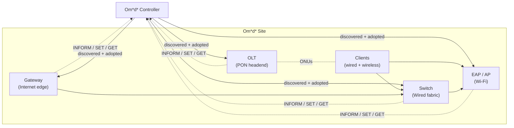
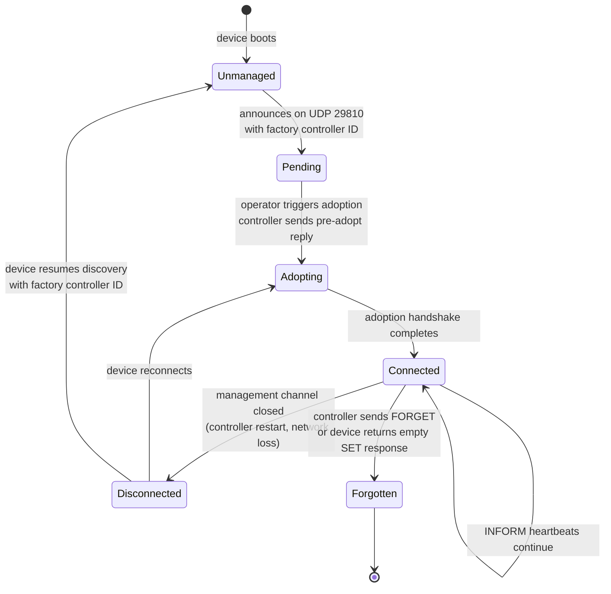
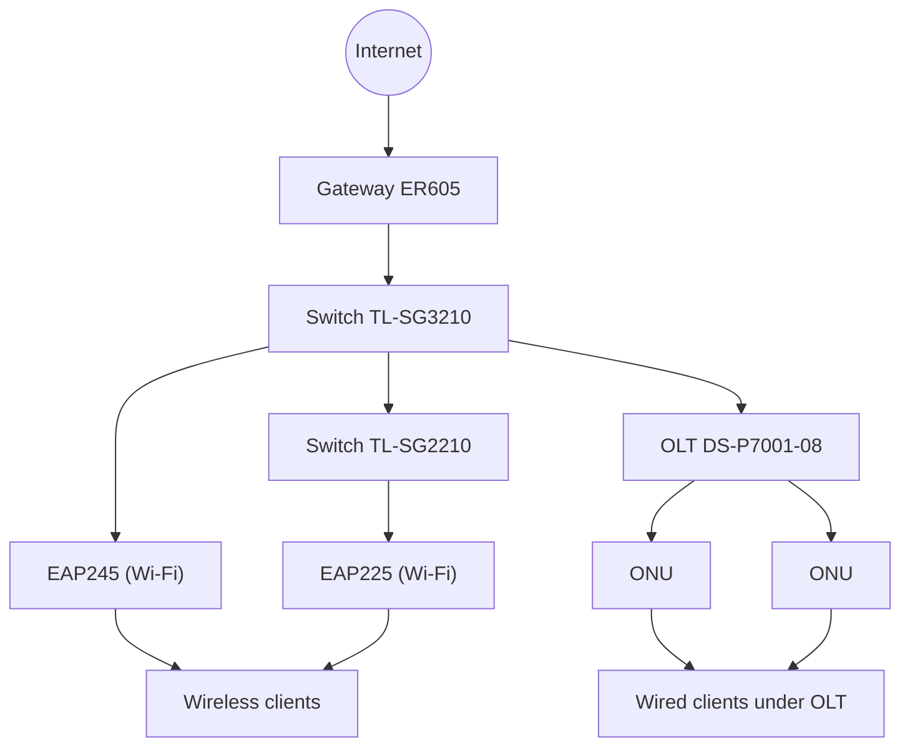

# 2 — Concepts

> Prerequisite: [1 — Introduction](01-introduction.md).

## 2.1 The controller–agent model

Om\*d\* uses a **controller–agent** model. The controller is the single source
of truth for configuration and monitoring; each device is an agent that:

1. Announces its existence so the controller can discover it.
2. Proves its identity and adopts into a controller-owned site.
3. Periodically reports its state (INFORM).
4. Accepts configuration the controller pushes (SET).
5. Answers queries (GET) and serves operator Tools on demand.

The controller never reaches into a device's management interface. All
communication is device-initiated or controller-pushed over long-lived
connections the device opens to the controller.

## 2.2 Device identity

Every device is uniquely identified by its **MAC address** (formatted
`AA-BB-CC-DD-EE-FF`, hyphenated uppercase). The MAC is the identity key the
controller uses to track a device across discovery, adoption, and operation.

Alongside the MAC, a device advertises identifying metadata:

| Field | Meaning | Example |
|---|---|---|
| `model` | Product model string | `EAP245`, `TL-SG3210`, `ER605`, `DS-P7001-08` |
| `model_version` / `modelVersion` | Hardware/model revision | `2.0`, `3.0` |
| `firmware_version` / `firmwareVersion` | Running firmware version | `1.2.3` |
| `hardware_version` / `hardwareVersion` | Hardware board version | `1.0` |
| `name` | Device host name | `AP-Floor2` |

> The exact field names differ between device types (long-name vs short-name
> forms). See [§8](08-device-types.md) for the per-type field set.

## 2.3 The adoption lifecycle

A device moves through a well-defined set of states. The controller drives the
transitions; the device reacts to controller messages.

| State | Meaning |
|---|---|
| **Unmanaged** | The device is announcing but not yet adopted by any controller. |
| **Pending** | The controller has seen the device and offers it for adoption. |
| **Adopting** | The adoption handshake (verify + negotiate + sync) is in progress. |
| **Connected** | Adoption complete; the device is online and sending INFORM heartbeats. |
| **Disconnected** | The management channel dropped; the device will attempt to reconnect. |
| **Forgotten** | The controller has released the device; it must be re-discovered. |

## 2.4 Sites

A **site** is a logical container for a set of devices and their clients. When
a device is adopted it joins the operator-selected site. Configuration pushed
via SET is scoped to the site. A controller may host multiple sites, but a
device belongs to exactly one site at a time.

The controller identifier (`controller ID`, an opaque hex string) distinguishes
controller instances. A device that announces a *different* controller's ID is
shown as "managed by another controller" and is not offered for adoption.

## 2.5 Device classes and their roles

Om\*d\* manages four classes of infrastructure device. Each plays a distinct role
in the site topology:

| Class | Role | Typical position |
|---|---|---|
| **Gateway (ER)** | Internet edge; site default route; DHCP server; firewall/NAT; VPN | Top of the wired network |
| **Switch** | Wired fabric; port-level telemetry; PoE provider; L2/L3 forwarding | Between gateway and access layer |
| **EAP / AP** | Wi-Fi access; radio/SSID management; wireless client association | Access layer (powered by switch PoE) |
| **OLT** | PON headend; manages ONUs over passive optical splitters | Fibre aggregation point |

The controller visualises the topology automatically from LLDP neighbour
tables and MAC forwarding databases the devices report in their INFORMs — not
from manual configuration.

### Sample site topology

## 2.6 What "compatible" means

A device is considered **compatible** with the Om\*d\* Controller v6.2.x when:

1. It is **discovered** by the controller (UDP announce accepted).
2. It can be **adopted** (the full handshake completes and the device reaches
   the **Connected** state).
3. It stays **online** (periodic INFORM heartbeats keep it from timing out).
4. It accepts and acknowledges **SET** configuration pushes.
5. It **appears in operator Tools** it claims to support (e.g. a device that
   advertises terminal support appears in the Terminal picker).

A device that advertises an empty component manifest during negotiation is
flagged **incompatible** by the controller and cannot be adopted. See
[§5.6](05-discovery-and-adoption.md#56-negotiation-and-compatibility).

---

Next: [3 — Architecture](03-architecture.md)