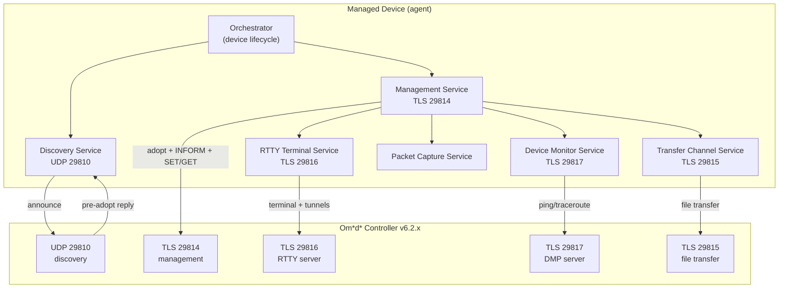

# 3 — Architecture

> Prerequisite: [2 — Concepts](02-concepts.md).

## 3.1 Logical architecture

A managed device is best modelled as a set of **cooperating services**, each
owning one long-lived connection to the controller. The services are
independent but coordinated: the discovery service finds the controller; the
management service owns adoption and steady-state; the auxiliary services are
started on demand when the controller pushes the corresponding SET keys.

The **orchestrator** owns the per-device lifecycle: it resolves the controller
ID, starts discovery, and — on a pre-adopt reply — starts the management
service. The management service, upon receiving a config-push key
(`terminalSetting`, `monitorServer`, `packageCapture`, `transferChannel`),
starts or stops the corresponding auxiliary service.

## 3.2 Channel map

All controller-facing channels use TLS (except UDP discovery). The device is
always the TLS client; the controller is the server.

| Port | Protocol | Service | Direction | Purpose |
|---:|---|---|---|---|
| 29810 | UDP | Discovery | device → controller (announce) / controller → device (pre-adopt reply) | Device announces its existence; controller replies to trigger adoption |
| 8043 | HTTPS | Info API | device → controller | `GET /api/info` resolves the controller ID |
| 29814 | TCP/TLS | Management | bidirectional | Adoption handshake, INFORM heartbeat, SET/GET, NOTIFY, file-transfer responses |
| 29815 | TCP/TLS | Transfer | bidirectional | File-transfer channel handshake and partition requests |
| 29816 | TCP/TLS | RTTY | bidirectional | Remote terminal + reverse tunnels (Tools → Terminal) |
| 29817 | TCP/TLS | Device Monitor | bidirectional | Network Check (ping/traceroute) over protobuf |
| 8088 | HTTP | Controller UI | (operator) | Redirects to HTTPS 8043 (operator browser only) |

> The legacy management/adopt/upgrade ports (29811–29813) belong to an
> earlier device-protocol generation (ECSP v1) and are not supported for new
> devices on Controller v6. They are intentionally omitted from this
> specification; see [Appendix B — Legacy Protocol](appendix-b-legacy-protocol.md)
> for the v1 port table and migration guidance.

## 3.3 TLS requirements

Every controller-facing TCP channel (29814, 29815, 29816, 29817) presents a
**vendor TLS certificate** with `CN=localhost` and requires **no client
certificate**. The device:

- MUST wrap the TCP socket in TLS before sending any data.
- MUST set the TLS SNI / `server_hostname` to `localhost`.
- MAY disable certificate verification in a lab setting. A production device
  SHOULD validate against the controller's real certificate.
- A plain-TCP connection (no TLS handshake) to any of these ports is silently
  dropped by the controller.

## 3.4 Framing family

The channels use three distinct framing families, summarized here and
detailed in their respective documents:

| Channel | Framing | Detailed in |
|---|---|---|
| Discovery (29810) | 4-byte BE length prefix + UTF-8 JSON | [§4.2](04-wire-protocol.md#42-wire-framing) |
| Management (29814) | same 4-byte BE length prefix + JSON, inside TLS | [§4.2](04-wire-protocol.md#42-wire-framing) |
| Transfer (29815) | same 4-byte BE length prefix + JSON, inside TLS | [§7.4](07-auxiliary-channels.md#74-transfer-channel-port-29815) |
| RTTY (29816) | binary: `type(1)` + `length(2 or 4 BE)` + payload | [§7.1](07-auxiliary-channels.md#71-rtty-terminal-port-29816) |
| Device Monitor (29817) | 4-byte BE length prefix + protobuf bytes | [§7.2](07-auxiliary-channels.md#72-device-monitor--network-check-port-29817) |

## 3.5 Concurrency and connection model

A device SHOULD maintain **one persistent connection per channel** and SHOULD
NOT open a new connection per message. Recommended behaviour:

- Each service runs a long-lived connection with a **reconnect loop**. On
  disconnect, the service waits a short backoff (reference: 5 seconds) and
  reconnects.
- The discovery service SHOULD use a **stable source UDP port** so the
  controller's pre-adopt reply reaches it. A socket opened per-announce with
  no listen loop will miss the reply.
- Each channel SHOULD send a **heartbeat** to keep the connection alive:
  - Management: INFORM every 10 seconds.
  - RTTY: HEARTBEAT every 10 seconds.
  - Device Monitor: heartbeat (MSG_EMPTY with current epoch) every 10 seconds.
- Auxiliary services are started/stopped by the management service in
  response to SET keys (see [§6.2.1](06-steady-state.md#621-config-push-keys-that-start-auxiliary-channels)).
- When the management channel closes, all auxiliary channels SHOULD be
  stopped and the device SHOULD resume discovery (see
  [§6.6](06-steady-state.md#66-reconnect-and-disconnect-handling)).

## 3.6 Reference implementation note

This specification is language-agnostic. The reference implementation that
validated every value herein was written in Python, but any language may be
used. What matters is the **wire behaviour**: the bytes on the
network, the message ordering, and the timing. Internal architecture (threads,
processes, async runtimes) is an implementation choice, provided the device
honours the connection, heartbeat, and reconnect requirements above.

---

Next: [4 — Wire Protocol](04-wire-protocol.md)