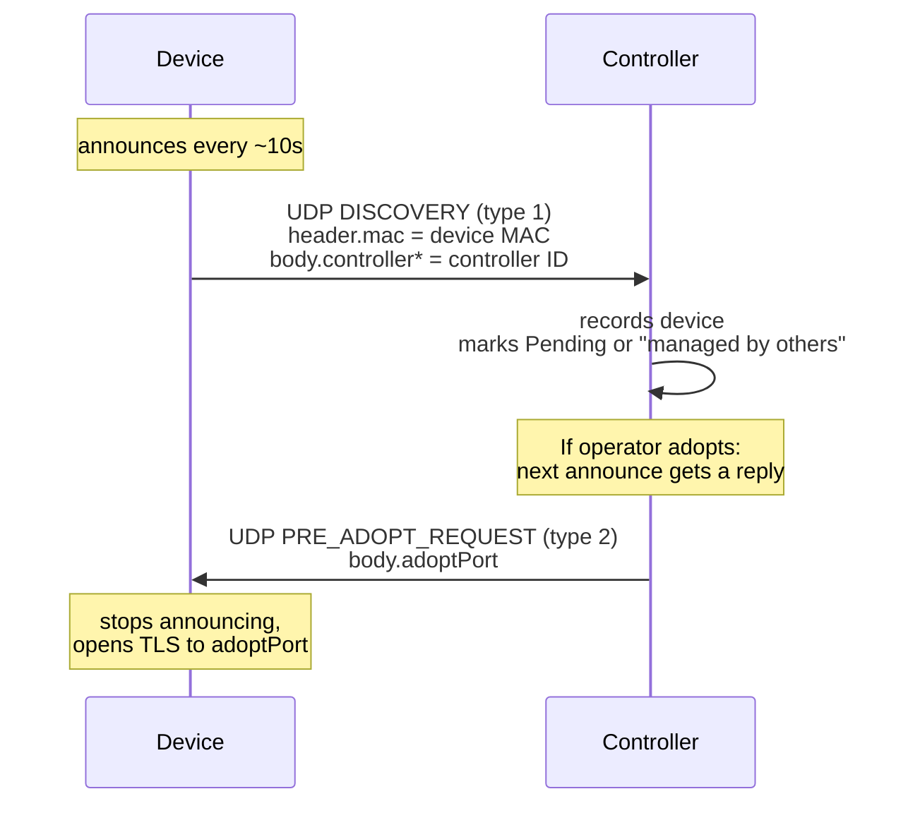
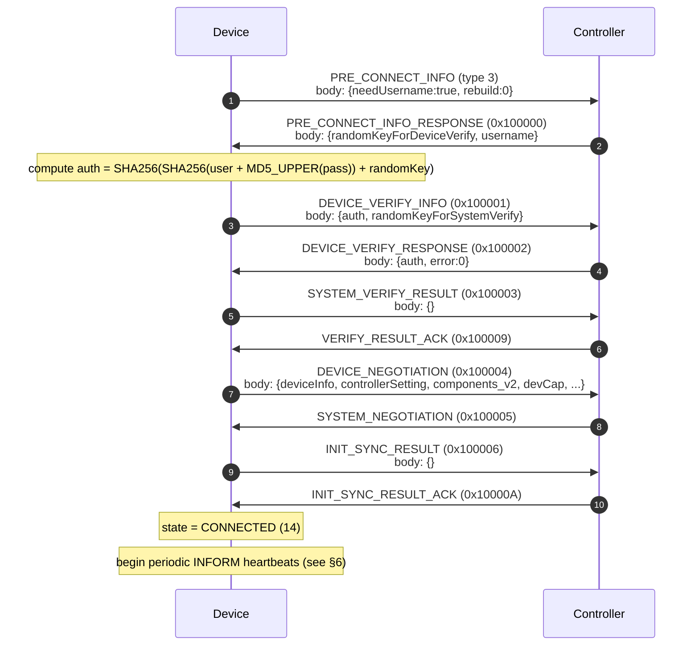

# 5 — Discovery & Adoption

> Prerequisite: [4 — Wire Protocol](04-wire-protocol.md).

This document specifies how a device becomes known to the controller
(**discovery**) and how it is taken under management (**adoption**).

## 5.1 Controller-ID resolution

Before a device can adopt, it needs the controller's unique identifier (the
**controller ID**, an opaque hex string). The device resolves it from the
controller's unauthenticated info endpoint:

```
GET https://<controller-host>:8043/api/info
```

The response body contains `result.omadacId` — the controller ID. The device
MUST use this value in the adoption handshake (see [§5.6](#56-negotiation-and-compatibility)).

> The controller presents a TLS certificate with `CN=localhost`. The device
> MAY disable certificate verification for this call in a lab setting; a
> production device SHOULD validate against the controller's real certificate.

## 5.2 Discovery announces

A device announces itself by sending a **DISCOVERY** message (`type 1`) as a
plaintext-JSON UDP datagram to the controller on **port 29810**. The announce
MUST be repeated periodically (the reference cadence is **10 seconds**).



### 5.2.1 Adoptability and the factory sentinel

The controller decides whether a discovered device is adoptable based on the
**controller ID** the device announces:

| Device announces | Controller shows |
|---|---|
| The **factory sentinel** `c21f969b5f03d33d43e04f8f136e7682` | **Pending** — offered for adoption |
| Any other controller's real ID | "Managed by another controller" — not adoptable |

A device that wishes to be adopted MUST announce the factory sentinel until it
has adopted, then switch to the real controller ID. After being forgotten or
disconnected, the device SHOULD revert to the factory sentinel to become
adoptable again.

### 5.2.2 Discovery body shapes per device class

The DISCOVERY `body` shape differs per device class. The most important
difference is the **controller-ID field path**: access points use
`controllerSetting.controllerId`; switches, gateways, and OLTs use
`controller.id`. Using the wrong key causes the controller to reject the
announce.

| Aspect | AP (`ap`) | Switch (`switch`) | Gateway (`gateway`) | OLT (`olt`) |
|---|---|---|---|---|
| Controller-ID path | `controllerSetting.controllerId` | `controller.id` | `controller.id` | `controller.id` |
| `deviceInfo` key style | **long** (`modelVersion`, `firmwareVersion`, `hardwareVersion`, `upTime`) | **short** (`modelVer`, `fwVer`, `hwVer`, `time`) | **short** + `cerVer`, `wireless` | **long** + `upTime` as integer |
| `deviceMisc` content | `customizeRegion` | `portNum` | `portNum`, `customizeRegion` | `modelType:"NORMAL"`, `category:"OLT"` |
| Extra top-level | — | `stackId` | — | — |
| `upTime` format | string `"<N> days HH:MM:SS"` | string `"<N> days HH:MM:SS"` | string `"<N> days HH:MM:SS"` | integer (seconds) |

The `customizeRegion` (AP) and the AP `controllerSetting.controllerId` fields
are **required** — omitting either causes the controller to drop the announce.

> The full per-class field set is specified in [§8](08-device-types.md).

## 5.3 Pre-adopt reply

When an operator triggers adoption, the controller answers the device's next
DISCOVERY announce with a **PRE_ADOPT_REQUEST** (`type 2`) UDP datagram back to
the device's source address:

```json
{
  "header": { "type": 2, "dest": "<controllerId>", "mac": "<device MAC>", ... },
  "body":   { "adoptPort": 29814 }
}
```

On receiving this, the device MUST **stop announcing** (further announces abort
adoption) and open a TLS connection to `body.adoptPort` (default 29814) on the
controller host to begin the adoption handshake.

## 5.4 Adoption handshake

The adoption handshake runs over the TLS management channel (29814). It is a
device-initiated sequence of verify → negotiate → sync that ends with the
device reaching the **Connected** state.



### Step-by-step body fields

| # | Message (`type`) | Key `body` fields |
|---|---|---|
| 1 | PRE_CONNECT_INFO (`3`) | `{needUsername:true, rebuild:0}` |
| 2 | PRE_CONNECT_INFO_RESPONSE (`0x100000`) | `{randomKeyForDeviceVerify, username}` |
| 3 | DEVICE_VERIFY_INFO (`0x100001`) | `{auth, randomKeyForSystemVerify}` |
| 4 | DEVICE_VERIFY_RESPONSE (`0x100002`) | `{auth, error}` — `error==0` means authenticated |
| 5 | SYSTEM_VERIFY_RESULT (`0x100003`) | `{}` |
| 6 | VERIFY_RESULT_ACK (`0x100009`) | (mutual verification complete) |
| 7 | DEVICE_NEGOTIATION (`0x100004`) | `{key, configVersion, deviceInfo, controllerSetting:{controllerId}, components:"", components_v2:{...}, channelInfo:[], radioCap:[], devCap:{...}, deviceMisc:{...}}` |
| 8 | SYSTEM_NEGOTIATION (`0x100005`) | controller's negotiation reply (may carry `userAccount` for Force Provision) |
| 9 | INIT_SYNC_RESULT (`0x100006`) | `{}` (echoes the request `seq`) |
| 10 | INIT_SYNC_RESULT_ACK (`0x10000A`) | device → **CONNECTED** (status 14) |

Device-initiated messages (steps 1, 3, 5, 7, 9) MUST carry an incrementing
`header.seq`. Controller replies echo the request's `seq`.

## 5.5 Device authentication

The device proves it knows the management credential by returning an `auth`
token computed as a hash chain. Every intermediate hash is rendered as
**UPPERCASE** hexadecimal before being fed into the next hash — the casing is
significant and changes the final result.

**Inputs:**
- `username` — the controller-supplied username (from step 2's `body.username`).
- `password` — the device's management credential (factory default `admin`).
- `random_key` — the controller-supplied nonce (`body.randomKeyForDeviceVerify`).

**Pseudocode:**

```
function md5_upper(text) =
    uppercase(hex(md5(utf8_encode(text))))

function sha256_upper(text) =
    uppercase(hex(sha256(utf8_encode(text))))

inner = sha256_upper(username + md5_upper(password))
auth  = sha256_upper(inner + random_key)
```

The device sends `auth` in step 3 (`DEVICE_VERIFY_INFO`). If the controller's
`DEVICE_VERIFY_RESPONSE` carries `error == 0`, the device is authenticated.

### 5.5.1 The device nonce

The device MUST also send its own nonce, `randomKeyForSystemVerify`, in step 3.
It MUST be a **36-character hyphenated UUID** (e.g.
`550e8400-e29b-41d4-a716-446655440000`). Controllers reject shorter values
before checking authentication.

### 5.5.2 The management credential

The credential is the **device account**, not the controller login. The factory
default is username `admin`, password `admin`. After a Force Provision (see
[§5.7](#57-force-provision--rebuild)), the device MUST use the site's Device
Account, which the controller supplies in `SYSTEM_NEGOTIATION`/`INIT_SYNC`
under `userAccount.newUsername`/`newPassword`.

## 5.6 Negotiation and compatibility

Step 7, **DEVICE_NEGOTIATION**, carries the device's capability manifest. The
controller uses it to decide whether the device is compatible and how to
configure it. Key `body` fields:

| Field | Description |
|---|---|
| `configVersion` | The device's current configuration version string (start at `"0"`). |
| `deviceInfo` | Per-class device metadata (see [§8](08-device-types.md)). |
| `controllerSetting.controllerId` | The **real** controller ID (resolved per [§5.1](#51-controller-id-resolution)), replacing the factory sentinel. |
| `components_v2` | Component manifest: a map `{componentName: version}`. **MUST be non-empty** — an empty manifest causes the controller to flag the device incompatible (status 7). |
| `channelInfo` | (AP only) per-radio channel lists. |
| `radioCap` | (AP only) per-radio capability (e.g. `supportSsidNum`). |
| `devCap` | Device capability flags. Set `supportTerminal:true` (and `terminalSupport:true`) so the device appears in the operator Terminal picker. |
| `deviceMisc` | Per-class misc metadata (e.g. `customizeRegion`, `portNum`, `category`). |

A device that advertises an empty `components_v2` is flagged **incompatible**
and cannot complete adoption. The manifest should list each component the
device supports, keyed by the component name with its version as a string
(e.g. `{"ssid":"2.3","wlanBasic":"2.0","terminalSetting":"1.0", ...}`). The
per-class component sets are enumerated in [§8](08-device-types.md).

## 5.7 Force Provision / rebuild

The controller can force a device to re-provision (e.g. after a controller
reset or a site change). On reconnect after a Force Provision, the device
sends PRE_CONNECT_INFO with `rebuild:1` (instead of `rebuild:0`) and uses the
site's Device Account credential (see [§5.5.2](#552-the-management-credential)).
The handshake otherwise proceeds as in [§5.4](#54-adoption-handshake).

## 5.8 Worked example — AP discovery body

Below is a minimal DISCOVERY body for an access point. The controller accepts
this announce and, if the operator adopts, replies with a pre-adopt UDP packet
on port 29810.

```json
{
  "header": {
    "mac": "AC-DE-48-00-01-02",
    "type": 1,
    "device": "ap",
    "version": "2.3.0",
    "verCap": 3,
    "timestamp": 1723632000000
  },
  "body": {
    "deviceInfo": {
      "ip": "10.0.2.20",
      "model": "EAP245",
      "modelVersion": "2.0",
      "firmwareVersion": "1.2.3",
      "hardwareVersion": "1.0",
      "name": "AP-Floor2",
      "upTime": "1 days 02:00:00",
      "cpuUti": 5,
      "memUti": 30,
      "wirelessLinked": false,
      "p2p": false
    },
    "deviceMisc": { "customizeRegion": 0 },
    "controllerSetting": { "controllerId": "c21f969b5f03d33d43e04f8f136e7682" }
  }
}
```

Note `wirelessLinked` is `false` — for a wired AP this MUST remain false, since
the controller refuses to adopt a wireless-uplink AP that has no available
uplink APs. The controller ID is the **factory sentinel**, marking the device
Pending.

---

Next: [6 — Steady-State Operation](06-steady-state.md)