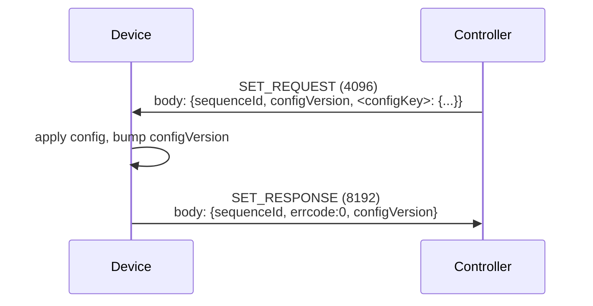
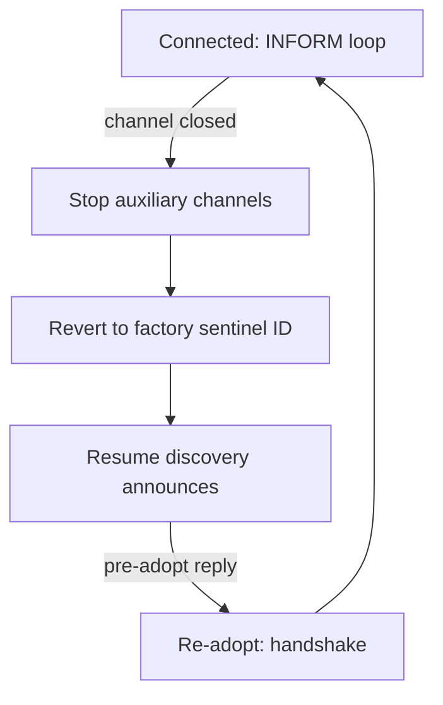

# 6 — Steady-State Operation

> Prerequisite: [5 — Discovery & Adoption](05-discovery-and-adoption.md).

Once the adoption handshake completes, the device is **Connected** (status
14). Steady-state operation keeps the device online and lets the controller
push configuration, query state, and receive event notifications.

## 6.1 INFORM heartbeat

A Connected device MUST send periodic **INFORM_REQUEST** (`type 256`) messages
on the management channel (29814). The reference interval is **10 seconds**.
Missing heartbeats cause the controller to mark the device disconnected.

```json
{
  "header": { "mac": "<MAC>", "type": 256, "device": "ap", "version": "2.3.0",
              "verCap": 3, "timestamp": 1723632010000, "seq": 42 },
  "body":   { "deviceInfo": { ... }, "configVersion": "5" }
}
```

| `body` field | Description |
|---|---|
| `deviceInfo` | Per-class device metadata (telemetry: uptime, CPU/memory utilisation, throughput). Shape differs per class — see [§8](08-device-types.md). |
| `configVersion` | The device's current applied configuration version. Echoes the latest `configVersion` the controller pushed via SET. |

The controller replies with **INFORM_RESPONSE** (`type 512`), which the device
MAY ignore (no payload of interest).

### 6.1.1 Per-class INFORM extra sections

Beyond `deviceInfo`, each class MAY include extra `body` sections carrying
telemetry the controller uses for the UI and topology. The shape and set of
sections differ per class and are specified in [§8](08-device-types.md). At a
high level:

| Class | Notable extra sections |
|---|---|
| AP | `clients`, `wSettings_2G/5G`, `radioTraffic_2G/5G`, `ssidStats_*`, `lanInfo`, `uplinkPortStatus`, `poeInform`, `mesh` |
| Switch | `port`, `lldp`, `fdb`, `client`, `poe`, `routingTable`, `lag`, `ddm`, `stpInform` |
| Gateway | `portInfo`, `vpn`, `sslVpn`, `wireguard`, `trafficStat`, `routingTable`, `client`, `dhcpClient`, `arp`, `ddns`, `qos`, … (largest set) |
| OLT | `deviceInfo` (with ONU counts), `trafficStat` (per-PON), `lldp` |

The controller builds the network topology from LLDP neighbour tables and MAC
forwarding databases reported in these sections — not from live GET queries.

## 6.2 SET / SET_RESPONSE

The controller pushes configuration with **SET_REQUEST** (`type 4096`). The
device MUST reply with **SET_RESPONSE** (`type 8192`) acknowledging it.



| `body` field (request) | Description |
|---|---|
| `sequenceId` | Identifier the device MUST echo in the response. |
| `configVersion` | The new configuration version the controller is pushing. |
| `<configKey>` | One or more named configuration objects (e.g. `ssid_2G`, `staticRouting`, `terminalSetting`). The set of keys is per-class (see [§8](08-device-types.md)). |

| `body` field (response) | Description |
|---|---|
| `sequenceId` | MUST echo the request's `sequenceId`. |
| `errcode` | `0` = success. Non-zero reports an apply error. |
| `configVersion` | The device's now-current config version. Echoing the pushed `configVersion` marks the config **applied**. |

> **Critical:** returning an **empty** body in a SET_RESPONSE makes the
> controller **forget** the device (treat it as unadopted). A device MUST
> always return a non-empty SET_RESPONSE with `errcode` and `configVersion`.

### 6.2.1 Config-push keys that start auxiliary channels

Some SET keys do not carry device configuration but instead command the device
to open an auxiliary channel. The runner pattern is: on receiving the key, the
device opens the corresponding TLS connection and starts serving.

| SET key | Action | Channel | See |
|---|---|---|---|
| `terminalSetting` | Start/stop the remote-terminal client | TLS 29816 | [§7.1](07-auxiliary-channels.md#71-rtty-terminal-port-29816) |
| `monitorServer` | Start/stop the device-monitor client | TLS 29817 | [§7.2](07-auxiliary-channels.md#72-device-monitor--network-check-port-29817) |
| `packageCapture` | Start/stop a packet capture | (uses transfer channel) | [§7.3](07-auxiliary-channels.md#73-packet-capture) |
| `transferChannel` | Open the file-transfer channel | TLS 29815 | [§7.4](07-auxiliary-channels.md#74-transfer-channel-port-29815) |

## 6.3 GET / GET_RESPONSE

The controller queries device state with **GET_REQUEST** (`type 24576`). The
device replies with **GET_RESPONSE** (`type 28672`) carrying the requested
data. The device SHOULD return the last-applied values for the requested
config keys.

## 6.4 NOTIFY

A device sends **NOTIFY_REQUEST** (`type 80`) to report an asynchronous event
to the controller. The controller replies with **NOTIFY_REPLY** (`type 144`).

> **Important:** the controller's notify dispatcher only **subject-routes**
> the V1 NOTIFY (`type 80`). The V2 variants (`NOTIFY_REQUEST_V2` `0x100007` /
> `NOTIFY_REPLY_V2` `0x100008`) are silently dropped. A device sending an event
> the controller must act on (e.g. packet-capture file ready) MUST use V1.

NOTIFY_REQUEST `body` carries a subject code (`sub`) selecting the event type,
and a content object (`ctnt`) with the event payload. The `header` MUST
include `dest` (the controller ID) and `timestamp` (epoch ms) — the controller
dereferences both unguarded.

Example (packet-capture file ready):

```json
{
  "header": { "mac": "<MAC>", "type": 80, "dest": "<controllerId>",
              "timestamp": 1723632020000 },
  "body":   { "nid": "<captureId>", "sub": 6, "nre": 1,
              "ctnt": { "errCode": 0, "cmdId": "<captureId>", "type": 1,
                        "fileInfos": [ { "fileName": "...", "filePath": "...",
                                         "fileSize": 12345, "md5": "..." } ] } }
}
```

## 6.5 FORGET / UPGRADE

- **FORGET_REQUEST** (`type 16384`): the controller releases the device. The
  device SHOULD respond with **FORGET_RESPONSE** (`type 20480`) and revert to
  the factory sentinel controller ID, resuming discovery.
- **UPGRADE_REQUEST** (`type 32768`): the controller offers a firmware
  upgrade. The device SHOULD reply with **UPGRADE_RESPONSE** (`type 65536`).
  Firmware transfer mechanics are out of scope for this specification.

## 6.6 Reconnect and disconnect handling

If the management channel closes (controller restart, network loss, or a
controller-initiated Force Provision), the device:

1. Stops all auxiliary channels (terminal, monitor, transfer) that depend on
   the management channel.
2. Reverts its announced controller ID to the **factory sentinel**.
3. Resumes discovery announces.
4. On the next pre-adopt reply, repeats the adoption handshake (with
   `rebuild:1` if the controller forced reprovisioning — see
   [§5.7](05-discovery-and-adoption.md#57-force-provision--rebuild)).



---

Next: [7 — Auxiliary Channels](07-auxiliary-channels.md)