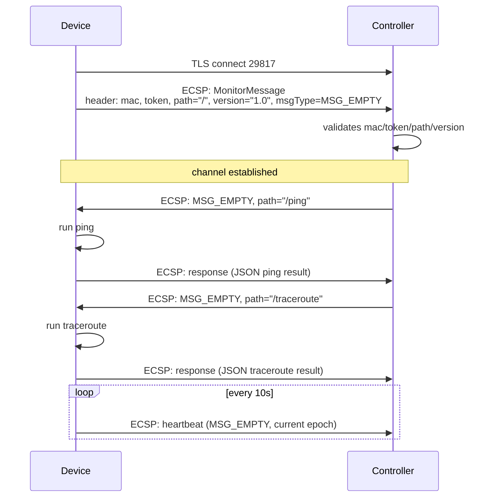
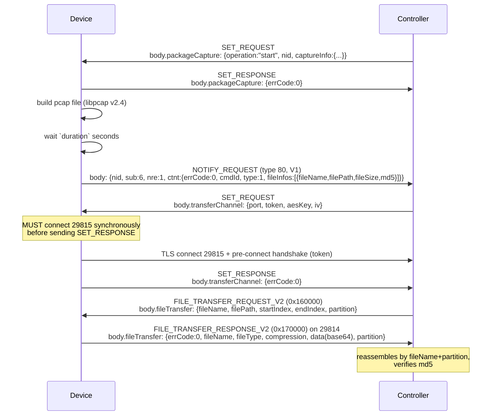
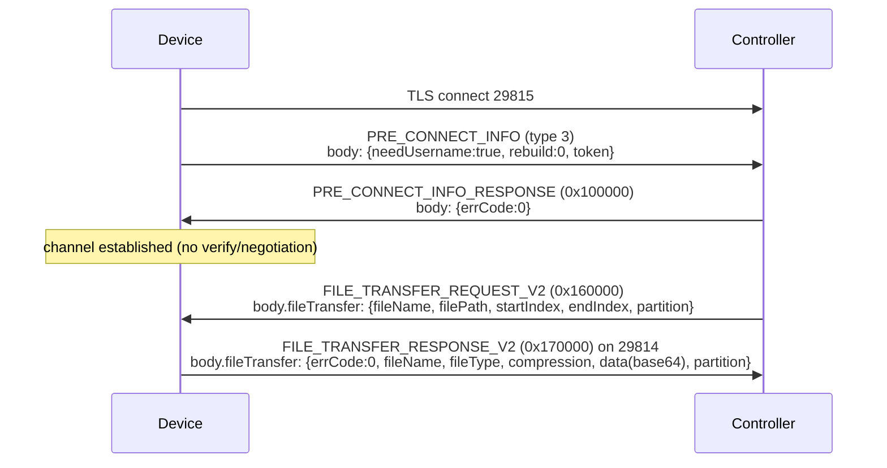

# 7 — Auxiliary Channels

> Prerequisite: [6 — Steady-State Operation](06-steady-state.md).

The controller's operator **Tools** tab offers four features that require
dedicated device-side channels beyond the management channel. Each is started
on demand by a SET key the controller pushes over the management channel
(29814).

| Feature | SET key | Channel | Framing |
|---|---|---|---|
| Terminal (RTTY) | `terminalSetting` | TLS 29816 | binary V1/V2 |
| Network Check | `monitorServer` | TLS 29817 | protobuf |
| Packet Capture | `packageCapture` | uses TLS 29815 | JSON (length-prefixed) |
| File Transfer | `transferChannel` | TLS 29815 | JSON (length-prefixed) |

## 7.1 RTTY Terminal (port 29816)

The remote-terminal channel. The device connects to the controller's RTTY
server on 29816 (TLS) and registers; the controller then opens terminal
sessions on the device and relays shell I/O. The same channel carries reverse
tunnels (TCP/HTTPS/SSH/Telnet) for the controller's Remote Access feature.

### 7.1.1 Frame format

RTTY uses a binary frame with two header variants selected by the message
type:

**V1 frame** (3-byte header) — used by REGISTER, LOGIN, LOGOUT, TERMDATA,
WINSIZE, CMD, HEARTBEAT, ACK, and the disconnect events:

```
 Byte offset
 0                   1                   2
 0 1 2 3 4 5 6 7 8 9 0 1 2 3 4 5 6 7 8 9 0 1 2 3 4 5 6 7
+-+-+-+-+-+-+-+-+-+-+-+-+-+-+-+-+-+-+-+-+-+-+-+-+-+-+-+-+-+-+
|     type (1)    |       length (uint16, BE)       |
+-+-+-+-+-+-+-+-+-+-+-+-+-+-+-+-+-+-+-+-+-+-+-+-+-+-+-+-+-+-+-+-+
|                                                       |
:                       payload                          :
:                   (length bytes)                        :
|                                                       |
+-+-+-+-+-+-+-+-+-+-+-+-+-+-+-+-+-+-+-+-+-+-+-+-+-+-+-+-+-+-+
```

**V2 frame** (5-byte header) — used by TCPDATA, HTTPSDATA, SSHDATA,
TELNETDATA, TUNNEL_ADD, TUNNEL_DELETE, STANDALONE_AUTH:

```
 Byte offset
 0                   1                   2                   3
 0 1 2 3 4 5 6 7 8 9 0 1 2 3 4 5 6 7 8 9 0 1 2 3 4 5 6 7 8 9 0 1
+-+-+-+-+-+-+-+-+-+-+-+-+-+-+-+-+-+-+-+-+-+-+-+-+-+-+-+-+-+-+-+-+
|     type (1)    |              length (uint32, BE)             |
+-+-+-+-+-+-+-+-+-+-+-+-+-+-+-+-+-+-+-+-+-+-+-+-+-+-+-+-+-+-+-+-+
|                                                               |
:                         payload                               :
:                       (length bytes)                           :
+-+-+-+-+-+-+-+-+-+-+-+-+-+-+-+-+-+-+-+-+-+-+-+-+-+-+-+-+-+-+-+-+
```

### 7.1.2 Message types

| Type | Name | Frame | Direction | Payload |
|---:|---|---|---|---|
| `0` | REGISTER | V1 | dev → ctrl | `version(1)` + `devid\0` + `description\0` + `token\0` (exactly 4 segments) |
| `0` | REGISTER | V1 | ctrl → dev | `err(1)` + `msg(UTF-8)` |
| `1` | LOGIN | V1 | ctrl → dev | `sid(32 bytes, ASCII hex)` |
| `1` | LOGIN | V1 | dev → ctrl | `sid(32)` + `code(1)` (`0`=ok, `1`=busy) |
| `2` | LOGOUT | V1 | ctrl → dev | `sid(32)` |
| `3` | TERMDATA | V1 | bidir | `sid(32)` + terminal data (UTF-8) |
| `4` | WINSIZE | V1 | ctrl → dev | `sid(32)` + `cols(uint16)` + `rows(uint16)` |
| `5` | CMD | V1 | ctrl → dev | `username\0password\0cmd\0sid\0…` |
| `6` | HEARTBEAT | V1 | dev → ctrl | `uptime(uint32, BE)` — MUST be non-empty |
| `9` | ACK | V1 | ctrl → dev | `sid(32)` + `ack(uint16)` |
| `20` | TCPDATA | V2 | bidir | `tunnelId(1)` + `requestId(16)` + data |
| `22` | HTTPSDATA | V2 | bidir | `tunnelId(1)` + `requestId(16)` + data |
| `31` | SSHDATA | V2 | bidir | `tunnelId(1)` + data (UTF-8) |
| `32` | TELNETDATA | V2 | bidir | `tunnelId(1)` + data (UTF-8) |
| `40` | TUNNEL_ADD | V2 | ctrl → dev | `tunnelId(1)` + `localAddress(uint32)` + `localPort(uint16)` |
| `41` | TUNNEL_DELETE | V2 | ctrl → dev | `tunnelId(1)` |
| `42` | STANDALONE_AUTH | V2 | ctrl → dev | `tunnelId(1)` + `usernameAndPassword(UTF-8)` |

### 7.1.3 Registration and session lifecycle

```mermaid
sequenceDiagram
    participant D as Device
    participant C as Controller
    D->>C: TLS connect 29816
    D->>C: REGISTER (V1)<br/>version=3, devid=MAC, description, token
    C->>D: REGISTER (V1)<br/>err=0, msg="OK"
    Note over D: registered; serve loop
    C->>D: LOGIN (V1)<br/>sid(32 bytes)
    D->>C: LOGIN (V1)<br/>sid + code=0 (ok)
    loop terminal session
        C->>D: TERMDATA (V1)<br/>sid + keystrokes
        D->>C: TERMDATA (V1)<br/>sid + shell output
    end
    C->>D: LOGOUT (V1)<br/>sid
    Note over D: drop session
```

Key requirements:

- The REGISTER `version` byte MUST be `>= 3`. The controller rejects lower
  versions with "unsupported protocol".
- The REGISTER payload is `version(1)` followed by `devid`, `description`,
  `token`, each NUL-terminated. The controller splits on `\0` and requires
  **exactly 4 segments** (the trailing NUL produces an empty fourth segment).
  An extra NUL yields 5 segments and the connection is dropped.
- The `token` comes from the `terminalSetting` SET push.
- The session ID (`sid`) is a **32-byte ASCII hex** string.
- HEARTBEAT payload MUST be non-empty (a `uint32` uptime). The controller
  reads an integer from it; an empty payload causes a read error.
- The device SHOULD send a HEARTBEAT every 10 seconds.

### 7.1.4 Reverse tunnels

The controller MAY open a reverse tunnel by sending TUNNEL_ADD with a
`tunnelId` and a `localAddress:localPort` on the device. The device opens a
real TCP connection to that local address and relays data bidirectionally as
TCPDATA/HTTPSDATA/SSHDATA/TELNETDATA frames tagged with the `tunnelId`.
TUNNEL_DELETE tears the tunnel down.

## 7.2 Device Monitor / Network Check (port 29817)

The device-monitor channel carries the Network Check feature (ping and
traceroute). Unlike the JSON channels, it uses **Google Protocol Buffers**
inside an ECSP packet frame. The controller is the server on 29817 (TLS); the
device connects and registers with a token.

### 7.2.1 ECSP frame

The outer frame is a 4-byte big-endian length prefix followed by the
serialized protobuf bytes (no type byte — the message type is inside the
protobuf header):

```
 Byte offset
 0                   1                   2                   3
 0 1 2 3 4 5 6 7 8 9 0 1 2 3 4 5 6 7 8 9 0 1 2 3 4 5 6 7 8 9 0 1
+-+-+-+-+-+-+-+-+-+-+-+-+-+-+-+-+-+-+-+-+-+-+-+-+-+-+-+-+-+-+-+-+
|                 protobuf length (uint32, BE)                   |
+-+-+-+-+-+-+-+-+-+-+-+-+-+-+-+-+-+-+-+-+-+-+-+-+-+-+-+-+-+-+-+-+
|                                                               |
:                   serialized MonitorMessage                   :
:                     (length bytes, protobuf)                  :
+-+-+-+-+-+-+-+-+-+-+-+-+-+-+-+-+-+-+-+-+-+-+-+-+-+-+-+-+-+-+-+-+
```

### 7.2.2 Protobuf schema

```protobuf
message MonitorMessageHeader {
  bytes  mac         = 1;   // raw MAC bytes (hyphens stripped)
  bytes  token       = 2;
  string path        = 3;
  string version     = 4;
  MsgTypeEnum msgType = 5;
  int32  seq         = 6;
  int32  devType     = 7;
  int32  errorCode   = 8;
  bool   needReply   = 9;
  int64  epochMs     = 10;  // fixed64 (little-endian on wire)
  int32  contentType = 11;
}
message MonitorMessage {
  MonitorMessageHeader header = 1;
  bytes data = 2;
}
message Component { int32 type = 1; bytes data = 2; }
message ComponentList { repeated Component components = 1; }
message JsonComponent { repeated string type = 1; bytes data = 2; }

enum MsgTypeEnum {
  MSG_UNSPECIFIED         = 0;
  MSG_EMPTY               = 1;
  MSG_COMPONENT_LIST      = 2;
  MSG_JSON_COMPONENT_LIST = 3;
}
```

### 7.2.3 Registration and probe handling



Key requirements:

- The register message MUST have non-empty `mac`, `token`, `path`, and
  `version`. The `mac` is **raw bytes** (hyphens stripped). The `token`, `path`
  (e.g. `"/"`), and `version` (e.g. `"1.0"`) come from the `monitorServer` SET
  push.
- The controller sends a probe as an MSG_EMPTY message with `path` set to
  `/ping` or `/traceroute`.
- The device replies with a JSON result. A **ping** result contains `target`,
  `packetsSent`, `packetsReceived`, `packetsLost`, `lossRate`, `minRtt`,
  `maxRtt`, `avgRtt`, `rtts` (list), and `status`. A **traceroute** result
  contains `target` and `hops` (each with `hop`, `ip`, `rtts`, `status`).
- The device SHOULD send a heartbeat (MSG_EMPTY with the current epoch in
  `epochMs`) every 10 seconds.
- On disconnect, the device SHOULD reconnect after a short backoff
  (reference: 5 seconds).

## 7.3 Packet Capture

Packet Capture is not its own channel — it is a workflow that uses the
management channel (29814), the NOTIFY mechanism, and the transfer channel
(29815). The full flow:



Key requirements:

- The device MUST acknowledge the `packageCapture` SET with
  `{packageCapture:{errCode:0}}`. Without it the UI shows "No device response".
- The capture file MUST be a valid **libpcap v2.4** file (magic `0xA1B2C3D4`,
  `LINKTYPE_ETHERNET`). The reference implementation produces synthetic ARP,
  ICMP, TCP 3-way-handshake, and UDP DNS frames with correct checksums.
- The file-ready notification MUST be a **V1 NOTIFY_REQUEST (`type 80`)** with
  subject `sub: 6` (file transfer). The V2 notify is silently dropped. The
  `header` MUST include `dest` (controller ID) and `timestamp` (epoch ms).
- After the notify, the controller pushes a `transferChannel` SET. The device
  MUST **connect to 29815 and complete the pre-connect handshake before
  sending the SET_RESPONSE** — the controller checks the transfer route cache
  synchronously in the same request.
- The controller requests the file in **512 KB partitions** via
  FILE_TRANSFER_REQUEST_V2. The device replies with FILE_TRANSFER_RESPONSE_V2
  carrying base64-encoded partition data.
- FILE_TRANSFER_RESPONSE_V2 is sent on the **management channel (29814)**,
  not on 29815. (Sending REQUEST frames from a device is rejected and closes
  the channel.)

## 7.4 Transfer Channel (port 29815)

The file-transfer channel. Its handshake is simpler than the management
channel — it uses the same JSON envelope and framing but skips verify and
negotiation.



Key requirements:

- The pre-connect body carries the `token` from the `transferChannel` SET
  (in addition to the standard `{needUsername, rebuild}` fields).
- The controller replies with PRE_CONNECT_INFO_RESPONSE carrying `errCode`.
  If `errCode == 0` the channel is established. There is **no verify and no
  negotiation** — unlike the management channel.
- The device serves FILE_TRANSFER_REQUEST_V2 partition requests, replying on
  the **management channel (29814)**, not on 29815.
- The device SHOULD reconnect after a short backoff (reference: 5 seconds) on
  disconnect.

### 7.4.1 FILE_TRANSFER_REQUEST_V2 body

```json
{
  "fileTransfer": {
    "fileName": "capture.pcap",
    "filePath": "/tmp/capture.pcap",
    "startIndex": 0,
    "endIndex": 524287,
    "partition": 0
  }
}
```

### 7.4.2 FILE_TRANSFER_RESPONSE_V2 body

```json
{
  "fileTransfer": {
    "errCode": 0,
    "fileName": "capture.pcap",
    "fileType": "...",
    "compression": 0,
    "data": "<base64-encoded partition bytes>",
    "partition": 0
  }
}
```

---

Next: [8 — Device Types](08-device-types.md)