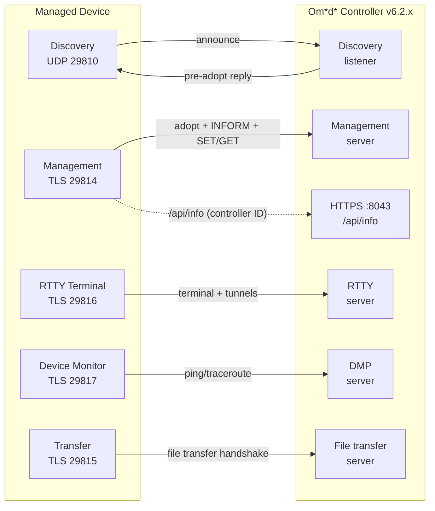

# Om\*d\*-Compatible Device Specification

This document set specifies how a network device communicates with a
**TP-L\*nk Om\*d\* Software Controller** (v6.2.x) so that the controller can
discover it, adopt it, manage it, and offer operator Tools for it.

It is intended for engineers building devices compatible with Om\*d\* who have
**no prior knowledge of Om\*d\* technology**. It is language- and
platform-agnostic and is written in the style of a technical specification.

## Reading order

| # | Document | What it covers |
|---|---|---|
| 1 | [Introduction](01-introduction.md) | Purpose, scope, target version, terminology, conventions |
| 2 | [Concepts](02-concepts.md) | Controller–agent model, device identity, adoption lifecycle, sites, device classes |
| 3 | [Architecture](03-architecture.md) | Logical services, channel map, TLS, framing family, concurrency |
| 4 | [Wire Protocol](04-wire-protocol.md) | Message envelope, framing, header fields, message-type constants, versioning |
| 5 | [Discovery & Adoption](05-discovery-and-adoption.md) | UDP discovery, pre-adopt, the adoption handshake, authentication, negotiation |
| 6 | [Steady-State Operation](06-steady-state.md) | INFORM heartbeat, SET/GET, NOTIFY, reconnect handling |
| 7 | [Auxiliary Channels](07-auxiliary-channels.md) | RTTY terminal, device monitor/network check, packet capture, file transfer |
| 8 | [Device Types](08-device-types.md) | Per-class specification: EAP, switch, gateway, OLT |
| A | [Appendix A — Feature Matrix](appendix-a-feature-matrix.md) | Comparison tables, quick references, glossary |
| B | [Appendix B — Legacy Protocol (ECSP v1)](appendix-b-legacy-protocol.md) | Deprecated ECSP v1 flow, ports, migration guidance |

**Recommended path:** read 1 → 2 → 3 → 4 in order, then 5 and 6 (the protocol
core), then 7 and 8 as needed. Use Appendix A for cross-type comparison, and
Appendix B if you must interoperate with or migrate from legacy ECSP v1
firmware.

## System at a glance

All controller-facing channels use TLS with a vendor certificate
(`CN=localhost`); the device acts as the TLS client. See [§3](03-architecture.md)
for details.

## Scope and target

This specification targets **Om\*d\* Controller v6.2.x** (device protocol
generation 2). Earlier controller versions and the legacy device-protocol
generation (legacy management/adopt/upgrade TCP ports and handshake) are
out of scope and not supported by Controller v6. See
[§1.2](01-introduction.md#12-scope) for the full scope statement. The
deprecated ECSP v1 generation is documented in
[Appendix B](appendix-b-legacy-protocol.md) for migration reference.