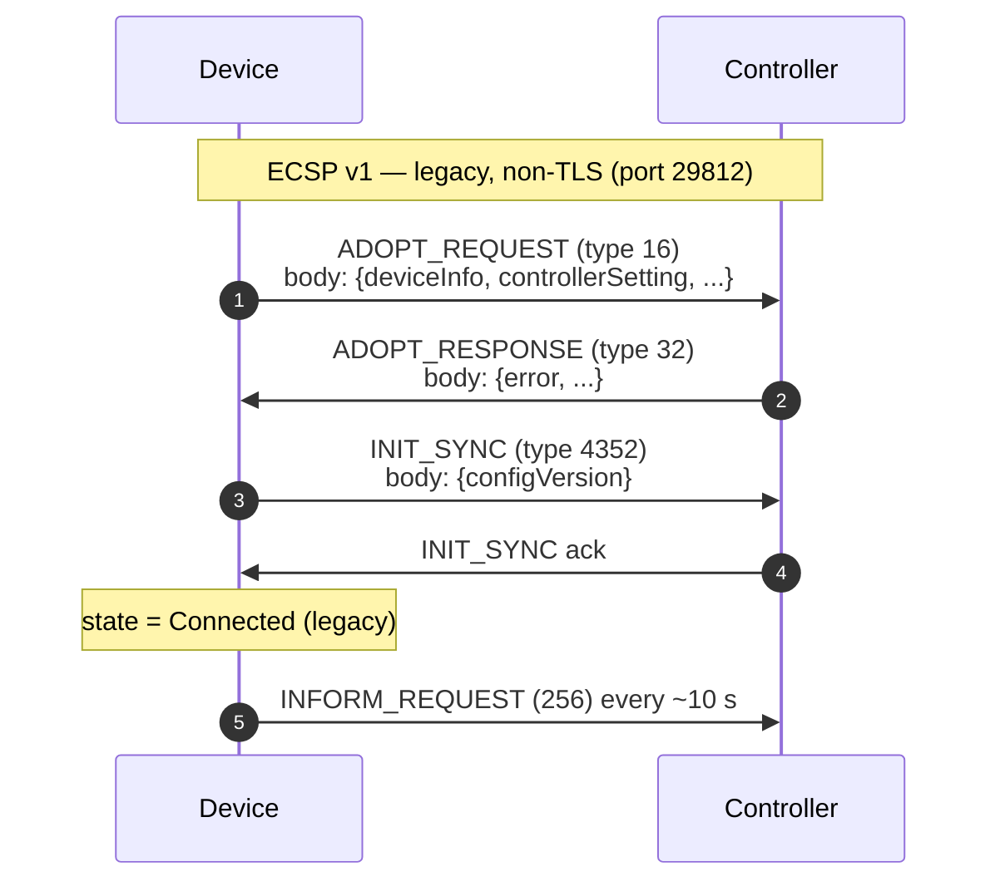

# Appendix B — Legacy Device Protocol (ECSP v1)

> This appendix documents the **earlier** device-protocol generation (ECSP v1)
> and its relationship to the current specification. New device
> implementations SHOULD target ECSP v2 (see
> [`README.md`](README.md)). This appendix is provided for implementations that
> must maintain, migrate, or interoperate with legacy firmware.

## B.1 What is ECSP?

**ECSP** is the Om\*d\* device/controller wire-protocol family. It defines the
interaction process and the exchanged message formats between a managed
device and the controller so that the device can be discovered, adopted,
configured, and monitored.

The protocol has two generations:

| Generation | Introduced | Security | Status on Controller v6.2.x |
|---|---|---|---|
| **ECSP v1** | Early device firmware | Baseline | **Deprecated.** Managed during a transition period only; the controller prompts users to upgrade firmware. |
| **ECSP v2** | Current device firmware | Enhanced | **Supported.** This is the target of this specification. |

A device reports the protocol version it supports in `header.version`
(see [§4.4](04-wire-protocol.md#44-protocol-versioning)) and the protocol
generation it is capable of in `header.verCap`. A device that supports a
higher protocol version reports that version when exchanging messages with
the controller.

## B.2 Deprecation on Controller v6.0 and above

Per the vendor's published guidance:

> Due to security vulnerabilities, Om\*d\* Network v6.0 and above will no
> longer support very old ECSP v1 firmware (unable to manage devices). A
> transition period is provided during which Om\*d\* Network v6.0 will still
> manage devices but will prompt users to upgrade to the latest firmware as
> soon as possible.

Practical consequences:

- A **new** device SHOULD implement **ECSP v2 only**. This is what the body of
  this specification describes.
- An **existing** device running ECSP v1 firmware may still be adopted and
  managed by Controller v6.2.x during the transition period, but the operator
  UI will display an upgrade prompt, and support is not guaranteed in future
  controller releases.
- The controller distinguishes the two generations by the advertised
  `header.version` and `header.verCap`, and by which TCP port the device
  connects to for adoption (see [§B.4](#b4-legacy-channels-and-ports)).

## B.3 ECSP v1 vs ECSP v2 at a glance

| Aspect | ECSP v1 (legacy) | ECSP v2 (current) |
|---|---|---|
| `header.version` | `"1.0.0"` (or a low minor) | `"2.2.0"` (wired) / `"2.3.0"` (AP) |
| `header.verCap` | advertises v1 capability | `3` (v2-capable; routes to the v2 branch) |
| Adoption TCP port | 29811 (management) / 29812 (adopt) | **29814** (management) |
| Upgrade port | 29813 | 29814 (management) |
| Transport | TCP (no TLS on the legacy adopt path) | **TLS** on 29814 |
| Authentication | `ADOPT_REQUEST` / `ADOPT_RESPONSE` (types 16/32) | Verify handshake: `PRE_CONNECT_INFO` → `DEVICE_VERIFY_INFO` → `DEVICE_VERIFY_RESPONSE` (§5.4) |
| Initial config sync | `INIT_SYNC` (type 4352) | `INIT_SYNC_RESULT` / `INIT_SYNC_RESULT_ACK` (§5.4) |
| Config rebuild | `REBUILD_REQUEST` / `REBUILD_RESPONSE` (36864/40960) | `PRE_CONNECT_INFO` with `rebuild:1` (§5.7) |
| Component manifest | `components` (string) | `components_v2` (non-empty map) |
| Security | Baseline | Enhanced (mutual verify, nonces, TLS) |

## B.4 Legacy channels and ports

ECSP v1 used separate TCP ports for each management function. These ports are
**not** used by ECSP v2 devices and are intentionally omitted from the main
channel table ([§3.2](03-architecture.md#32-channel-map)).

| Port | Protocol | Legacy service | ECSP v2 equivalent |
|---:|---|---|---|
| 29811 | TCP | Management (legacy) | 29814 (TLS) |
| 29812 | TCP | Adopt (legacy) | 29814 (TLS) |
| 29813 | TCP | Upgrade (legacy) | 29814 (TLS) |

A Controller v6.2.x instance still listens on these ports for transition-period
compatibility, but a new device SHOULD NOT connect to them. The current
management port is **29814** (TLS), which carries adoption, steady-state, and
upgrade flows in a single channel.

## B.5 Legacy adoption handshake (ECSP v1)

The v1 adoption flow used a simpler, non-TLS handshake on the legacy adopt
port (29812). The message envelope and framing are the same as
[§4.2](04-wire-protocol.md#42-wire-framing), but the `header` omits `verCap`
and the message types differ.

| Step | Message (`type`) | Direction | Notes |
|---|---|---|---|
| 1 | ADOPT_REQUEST (`16`) | device → controller | Carries `deviceInfo` and `controllerSetting.controllerId`. No verify nonce. |
| 2 | ADOPT_RESPONSE (`32`) | controller → device | `error == 0` ⇒ adopted. No mutual authentication of the controller. |
| 3 | INIT_SYNC (`4352`) | device → controller | Initial full-config sync. |
| 4 | INFORM_REQUEST (`256`) | device → controller | Periodic heartbeat (same as v2). |

Key differences from ECSP v2 ([§5.4](05-discovery-and-adoption.md#54-adoption-handshake)):

- **No mutual authentication.** The v1 flow has no `DEVICE_VERIFY_INFO` /
  `DEVICE_VERIFY_RESPONSE` exchange and no `randomKeyForSystemVerify` nonce.
  The device does not cryptographically prove the controller's identity.
- **No TLS.** The legacy adopt path was plain TCP.
- **`ADOPT_REQUEST` / `ADOPT_RESPONSE`** (types 16/32) replace the entire
  verify → negotiate → sync chain. There is no separate `DEVICE_NEGOTIATION`.
- **`INIT_SYNC`** (type 4352) is a single full-config sync message, replaced
  in v2 by the `INIT_SYNC_RESULT` / `INIT_SYNC_RESULT_ACK` pair (0x100006 /
  0x10000A).

## B.6 Legacy message types (not used by ECSP v2)

These message-type codes are reserved for the ECSP v1 flow and are NOT emitted
by an ECSP v2 device. They are listed here for migration and interoperability
reference only.

| Code | Name | Generation | Purpose |
|---:|---|---|---|
| `16` | ADOPT_REQUEST | v1 | Legacy adoption request (device → controller) |
| `32` | ADOPT_RESPONSE | v1 | Legacy adoption response (controller → device) |
| `4352` | INIT_SYNC | v1 | Legacy initial full-config sync |
| `36864` | REBUILD_REQUEST | v1 | Legacy config rebuild request |
| `40960` | REBUILD_RESPONSE | v1 | Legacy config rebuild response |

> An ECSP v2 device MUST NOT send these codes. The v2 equivalents are the
> verify/negotiate/init-sync handshake codes (0x100000–0x10000A, see
> [§4.5](04-wire-protocol.md#45-message-type-constants)) and the
> `rebuild:1` flag in `PRE_CONNECT_INFO` (see [§5.7](05-discovery-and-adoption.md#57-force-provision--rebuild)).

## B.7 Migration guidance

If a device currently speaks ECSP v1 and must migrate to ECSP v2:

1. **Advertise v2.** Set `header.version` to `"2.2.0"` (wired) or `"2.3.0"`
   (AP) and `header.verCap` to `3`. The controller uses these to route the
   device onto the v2 branch.
2. **Connect to 29814 with TLS.** Stop using the legacy 29811/29812/29813
   ports. Wrap the management socket in TLS with SNI `localhost`
   ([§3.3](03-architecture.md#33-tls-requirements)).
3. **Implement the verify handshake.** Replace `ADOPT_REQUEST`/`ADOPT_RESPONSE`
   with the `PRE_CONNECT_INFO` → `DEVICE_VERIFY_INFO` → `DEVICE_VERIFY_RESPONSE`
   → `SYSTEM_VERIFY_RESULT` → `VERIFY_RESULT_ACK` sequence
   ([§5.4](05-discovery-and-adoption.md#54-adoption-handshake)). Compute `auth`
   with the uppercase-hex SHA-256/MD-5 hash chain
   ([§5.5](05-discovery-and-adoption.md#55-device-authentication)).
4. **Send a 36-char UUID nonce.** `randomKeyForSystemVerify` MUST be a full
   hyphenated UUID; shorter values are rejected by Controller v6.2.x before
   auth is checked.
5. **Replace `INIT_SYNC` with the v2 sync pair.** Send `INIT_SYNC_RESULT`
   (0x100006) and wait for `INIT_SYNC_RESULT_ACK` (0x10000A) to reach
   Connected.
6. **Advertise a non-empty `components_v2` manifest.** The v2 controller flags
   an empty manifest as incompatible
   ([§5.6](05-discovery-and-adoption.md#56-negotiation-and-compatibility)).
7. **Handle Force Provision with `rebuild:1`.** Replace the legacy
   `REBUILD_REQUEST`/`REBUILD_RESPONSE` flow with `PRE_CONNECT_INFO` carrying
   `rebuild:1` and the site's Device Account credential
   ([§5.7](05-discovery-and-adoption.md#57-force-provision--rebuild)).

The INFORM heartbeat (type 256), SET/GET (4096/8192/24576/28672), and NOTIFY
(80/144) messages are common to both generations and do not change.

## B.8 Why v2: security

ECSP v2 was introduced to address security vulnerabilities in the v1 flow.
The enhancements are:

- **TLS on the management channel** (port 29814), replacing the plain-TCP
  legacy adopt path.
- **Mutual cryptographic authentication** via the verify handshake and the
  `auth` hash chain, so the device proves it knows the credential and the
  controller proves its identity back.
- **Device nonce** (`randomKeyForSystemVerify`, a 36-char UUID) to prevent
  replay.
- **Controller nonce** (`randomKeyForDeviceVerify`) as a fresh challenge per
  adoption.

A new device SHOULD implement ECSP v2 to benefit from these protections and
to remain manageable by future controller releases.

---

Back to: [`README.md`](README.md)